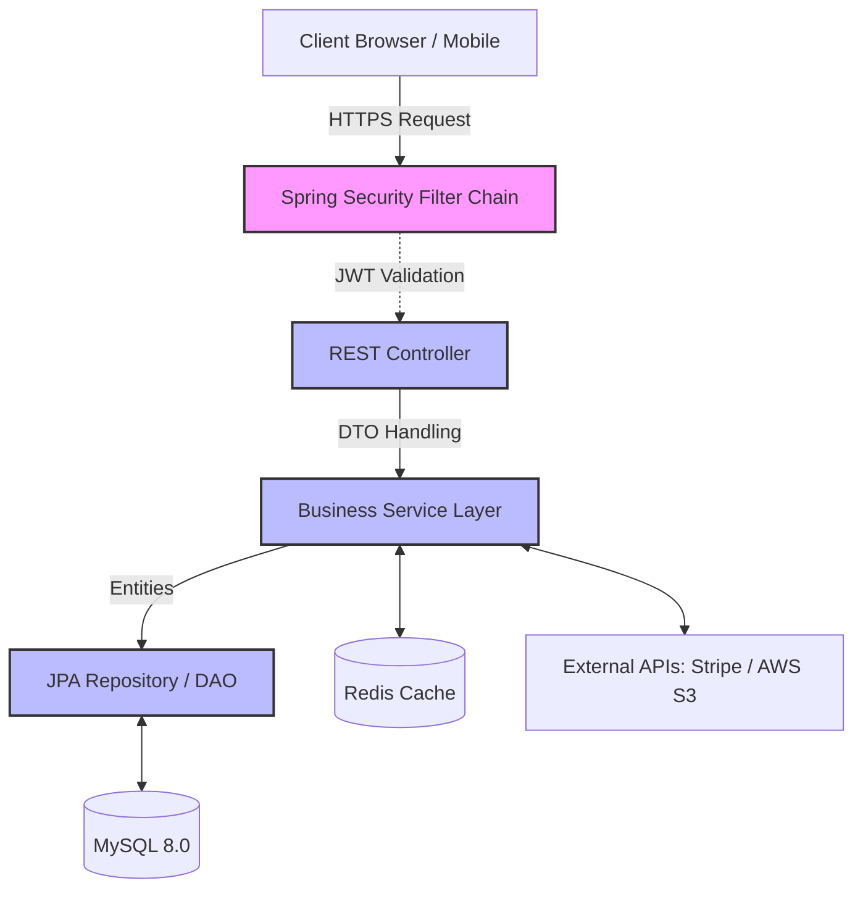

# 🛒 FSSE2510 Project Backend - E-Commerce API

> A Spring Boot backend API — supporting product management, shopping cart, Stripe payments, coupon engine, membership tiers, and RBAC access control.  
> Deployed on AWS Lightsail with fully automated CI/CD via GitHub Actions + Google Jib.

🔴 **Live Demo:** [https://johnmak.store](https://johnmak.store)

---

## ✨ Features

| Feature | Description |
|---------|-------------|
| 📦 **Product Catalog** | Paginated browsing, category filtering, dynamic sorting |
| 🛒 **Cart & Checkout** | Full cart lifecycle management with Stripe payment integration |
| 🎫 **Coupon Engine** | Admin-managed discount strategies (percentage / fixed amount) |
| ⭐ **Membership Tiers** | Bronze → Diamond tiered system with loyalty rewards |
| ❤️ **Wishlist** | Users can save and track favorite products |
| 🖼️ **Showcase Banners** | Admin-controlled homepage banners for marketing campaigns |
| 🔐 **RBAC Security** | Firebase Auth JWT + role segregation (Public / User / Admin) |

---

## 🛠️ Tech Stack

| Layer | Technology | Version / Notes |
|-------|-----------|-----------------|
| **Language** | Java | 21 |
| **Framework** | Spring Boot | 3.5.8 |
| **Data** | Spring Data JPA (Hibernate) | MySQL 8+ |
| **Cache** | Spring Data Redis | Read-heavy operation optimization |
| **Security** | Spring Security + OAuth2 Resource Server | Firebase JWT validation |
| **DTO Mapping** | MapStruct | Prevents Entity exposure |
| **Payments** | Stripe Java SDK | v24.1.0 + Webhooks |
| **Storage** | AWS S3 | Product image media storage |
| **DevOps** | Docker, Google Jib, GitHub Actions | AWS Lightsail |

---

## 🚀 Quick Start

### 1. Setup

```bash
cp .env.example .env
```

Ensure MySQL and Redis are running.

### 2. Start Development Server

```bash
./gradlew bootRun
```

Server runs on `http://localhost:8080` by default.

### 3. Environment Variables

| Category | Variables | Description |
|----------|-----------|-------------|
| **Database** | `DB_URL`, `DB_USER`, `DB_PASSWORD` | MySQL connection credentials |
| **Cache** | `REDIS_HOST`, `REDIS_PORT`, `REDIS_PASSWORD` | Redis connection details |
| **Security** | `JWT_ISSUER_URI` | Firebase Auth URI |
| **AWS S3** | `AWS_S3_BUCKET`, `AWS_S3_REGION`, `AWS_ACCESS_KEY`, `AWS_SECRET_KEY`, `IMAGE_BASE_URL` | Image uploads |
| **Stripe** | `STRIPE_SECRET_KEY`, `STRIPE_WEBHOOK_SECRET` | Payment processing |
| **App** | `ADMIN_EMAILS`, `APP_FRONTEND_URL` | Admin seeding, CORS |

---

## 🏗️ Architecture



### Technical Highlights

- **Two-Step Fetch Pattern** — Fetches `Slice<Integer>` IDs first, then shallow fetch, eliminating N+1 problem
- **Defensive DTO Boundary** — MapStruct strict mapping; Entity objects never exposed to Presentation layer
- **Global Exception Handler** — `@ControllerAdvice` intercepts all exceptions, returning standardized API error responses

---

## 📚 Project Documentation

All documentation is available in the [`docs/`](./docs) directory, viewable directly on GitHub:

### 📐 Requirements & Design

| Document | Description |
|----------|-------------|
| [📄 FUNCTIONAL_REQUIREMENTS.md](./docs/FUNCTIONAL_REQUIREMENTS.md) | Functional Requirements — User Stories + Gherkin acceptance criteria |
| [📄 NON_FUNCTIONAL_REQUIREMENTS.md](./docs/NON_FUNCTIONAL_REQUIREMENTS.md) | Non-Functional Requirements — Performance, security, scalability standards |
| [📄 USE_CASES.md](./docs/USE_CASES.md) | Use Cases — Actor-based UML use case diagrams |
| [📄 DEFINITION_OF_DONE.md](./docs/DEFINITION_OF_DONE.md) | Definition of Done — Quality gates and acceptance checklists |

### 🏗️ Architecture & Data

| Document | Description |
|----------|-------------|
| [📄 ARCHITECTURE.md](./docs/ARCHITECTURE.md) | System Architecture — Layered design, data flow, design patterns |
| [📄 DATABASE_SCHEMA.md](./docs/DATABASE_SCHEMA.md) | Database Schema — ER diagram, table definitions, indexes, relationships |
| [📄 SEQUENCE_DIAGRAMS.md](./docs/SEQUENCE_DIAGRAMS.md) | Sequence Diagrams — Mermaid diagrams for all critical business flows |

### 🔌 API

| Document | Description |
|----------|-------------|
| [📄 API_CONTRACT.md](./docs/API_CONTRACT.md) | API Contract — Full RESTful endpoint specification with request/response examples |

### ⚙️ Deployment & Decisions

| Document | Description |
|----------|-------------|
| [📄 DEPLOYMENT.md](./docs/DEPLOYMENT.md) | Deployment Guide — CI/CD pipeline, Docker, Jib, AWS Lightsail |
| [📄 BUSINESS_DECISIONS.md](./docs/BUSINESS_DECISIONS.md) | Business Decisions — ADRs documenting key technical and business trade-offs |

### 📊 Flowcharts & ER Diagrams

| Diagram | Description |
|---------|-------------|
| [🖼️ ER Diagram](./docs/diagrams/ER%20Diagram.svg) | Full entity-relationship diagram of the database |
| [🖼️ Add Cart to Finish Transaction](./docs/diagrams/AddCartToFinishTransactionLogicFlow.svg) | Cart-to-checkout business logic flowchart |
| [🖼️ Cart Promotion Enricher](./docs/diagrams/CartPromotionEnricherService.svg) | Promotion/coupon application service flow |
| [🖼️ Checkout & Transaction Flow](./docs/diagrams/Checkout%20%26%20Transaction%20Flow%20(Sequence%20Diagram).svg) | Checkout sequence diagram with Stripe |
| [🖼️ Discount Distribution (Penny Problem)](./docs/diagrams/Discount%20Distribution%20Flow(PennyProblem).svg) | Penny-rounding discount distribution logic |
| [🖼️ Firebase User Sync](./docs/diagrams/Firebase%20User%20Synchronization%20(Sequence%20Diagram).svg) | Firebase auth user synchronization flow |
| [🖼️ Membership State Machine](./docs/diagrams/Membership%20State%20Machine%20(Flowchart).svg) | Membership tier state transitions |
| [🖼️ Product Search Performance](./docs/diagrams/Product%20Search%20Performance%20Pattern%20(Sequence%20Diagram).svg) | Two-step fetch performance pattern |

---

## 🌐 Deploy to AWS Lightsail

1. Push to `main` branch
2. **GitHub Actions** automatically builds a Docker image using **Google Jib**
3. Pushes to DockerHub
4. SSH triggers rolling restart on AWS Lightsail

```yaml
# docker-compose.yml
version: '3.8'
services:
  backend:
    image: docker.io/johnmak101/project-backend:latest
    container_name: fsse-backend
    ports:
      - "8080:8080"
    restart: always
    env_file:
      - .env
    environment:
      - JAVA_TOOL_OPTIONS=-Xms512m -Xmx1g -XX:MaxMetaspaceSize=160m -Xss512k -XX:+UseG1GC
    deploy:
      resources:
        limits:
          memory: 1.5G
```

---

## ❓ Troubleshooting

- **JWT Validation Fails (401)** — Verify `JWT_ISSUER_URI` matches format `https://securetoken.google.com/<project-id>`
- **Stripe Webhook Signature Failed** — Ensure CLI webhook secret matches the endpoint secret in `.env`
- **Redis Connection Refused** — Check if Redis Docker container is running (`docker ps`)

---

Created by **John Mak** 🚀

*Last updated: 2026-03-18*
