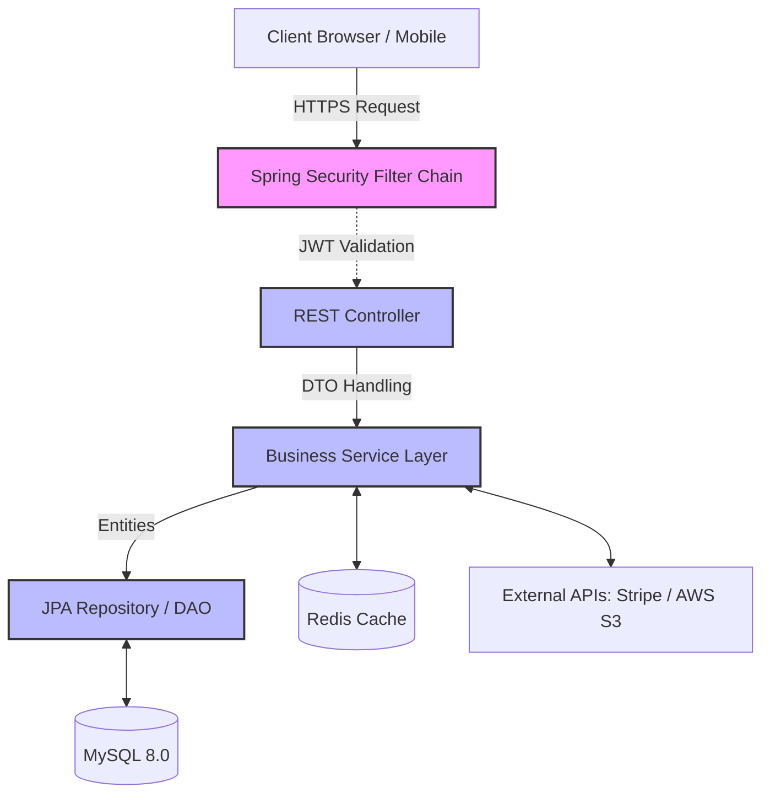

# FSSE2510 Project Backend - E-Commerce API

<div align="center">
  
  
  
  
  
  
  
</div>

<br />

A Spring Boot backend for a modern e-commerce platform. It provides RESTful APIs for product management, shopping cart operations, transaction processing, and role-based user authentication.

🔴 **Live Demo:** [https://johnmak.store](https://johnmak.store)

---

## Key Features & Business Logic

- ** Product Catalog & Inventory**
  - Product browsing with pagination, categorical navigation, and dynamic filtering.
  - Real-time inventory tracking and race-condition prevention during checkout.
- ** Shopping Cart & Secure Checkout**
  - Seamless lifecycle management from cart manipulation to order completion.
  - Integration with **Stripe API** and **Stripe Webhooks** for payment state consistency.
- ** Promotions & Loyalty Programs**
  - Admin-controlled **Coupon & Promotion Engine** supporting dynamic discount strategies.
  - **Membership Tiers System** providing loyalty benefits and specialized routing.
- ** Personalization & Aesthetics**
  - **Wishlist** functionality for users to save and track favorite products.
  - Dynamic **Showcase Banners** controlled by admin for marketing campaigns.
- ** Security (RBAC)**
  - Stateless architecture using **Firebase Auth (Google Secure Token)** for JWT signature validation.
  - **Role-Based Access Control (RBAC)** segregating Public, Authenticated User, and Admin APIs.

---

## Tech Stack & Architecture Design

### Core Technologies
- **Language/Framework**: Java 21, Spring Boot 3.5.8    
- **Data Persistence**: Spring Data JPA (Hibernate), MySQL 8+
- **Caching Layer**: Spring Data Redis (Optimizing read-heavy operations)
- **Security**: Spring Security, OAuth2 Resource Server
- **Mapping & Boilerplate**: MapStruct (DTO Mapping), Lombok
- **External Integrations**: Stripe Java SDK (v24.1.0), AWS S3 (Media Storage)
- **DevOps**: Docker, Google Jib, GitHub Actions, AWS Lightsail

### Data Flow

To ensure high maintainability and separation of concerns, the system strictly adheres to layered architecture:



### Technical Highlights

- **Two-Step Fetch Pattern & N+1 Prevention**: JPA Repositories utilize a custom optimized query pattern—fetching a `Slice<Integer>` of IDs first, followed by a shallow fetch. This effectively neutralizes N+1 problem and excessive `JOIN` memory bloat during pagination.
- **Defensive Boundary Control**: Strict DTO patterns using MapStruct. Business `Entity` objects are never exposed to the Presentation layer, preventing mass-assignment vulnerabilities.
- **Global Exception Handling**: A centralized `@ControllerAdvice` intercepts all exceptions to return sanitized, standardized, API-friendly error responses.

---

## Getting Started

### 1. Environment Setup

Copy your local configuration file and inject your secrets.
```bash
cp .env.example .env
```
Ensure all required backing services (MySQL, Redis) are running.

### 2. Build and Run Server

The application uses Gradle wrapper. Start the server (runs on port `8080` by default):
```bash
./gradlew bootRun
```

---

## Environment Variables Reference

When deploying or configuring your local environment, ensure the following are provided (via `.env` or CI/CD secrets):

| Category | Variables | Description |
|---|---|---|
| **Database** | `DB_URL`, `DB_USER`, `DB_PASSWORD` | MySQL connection credentials. |
| **Cache** | `REDIS_HOST`, `REDIS_PORT`, `REDIS_PASSWORD` | Redis connection details. |
| **Security** | `JWT_ISSUER_URI` | Firebase Auth URI (e.g., `https://securetoken.google.com/<project-id>`). |
| **AWS S3** | `AWS_S3_BUCKET`, `AWS_S3_REGION`, `AWS_ACCESS_KEY`, `AWS_SECRET_KEY`, `IMAGE_BASE_URL` | For product image uploads. |
| **Stripe** | `STRIPE_SECRET_KEY`, `STRIPE_WEBHOOK_SECRET` | Payment processing secrets. |
| **App Rules**| `ADMIN_EMAILS`, `APP_FRONTEND_URL` | RBAC admin seeding and CORS frontend URL. |

---

## Deployment (AWS Lightsail)

The application features a fully automated CI/CD pipeline. On every push to the `main` branch, **GitHub Actions** builds a lightweight Docker image using **Google Jib**, pushes it to DockerHub, and triggers a rolling restart on an **AWS Lightsail** instance via SSH.

### Example `docker-compose.yml`:
```yaml
version: '3.8'
services:
  backend:
    image: docker.io/johnmak101/project-backend:latest
    container_name: fsse-backend
    ports:
      - "8080:8080"
    restart: always
    env_file:
      - .env  
    environment:
      - JAVA_TOOL_OPTIONS=-Xms512m -Xmx1g -XX:MaxMetaspaceSize=160m -Xss512k -XX:+UseG1GC
    deploy:
      resources:
        limits:
          memory: 1.5G
```

---

## Troubleshooting

- **JWT Validation Fails (401 Unauthorized)**: Verify `JWT_ISSUER_URI` matches exactly format `https://securetoken.google.com/<project-id>`.
- **Stripe Webhook Signature Failed**: Ensure the CLI webhook secret matches the endpoint secret in `.env`.
- **Redis Connection Refused**: Check if your Redis Docker container is running (`docker ps`). Make sure correct port is mapped.

---
## Author
**John Mak**
