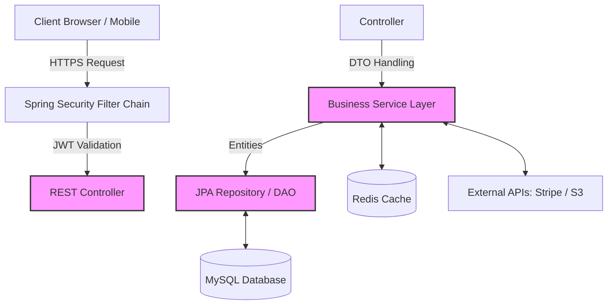

# FSSE2510 Project Backend


A production-ready Spring Boot backend for a modern e-commerce platform. It provides scalable RESTful APIs for product management, shopping cart operations, transaction processing, and secure user authentication.

## Key Features

- **Product Catalog & Inventory**: Advanced filtering, pagination, promotions engine, and real-time stock deduction.
- **Shopping Cart & Checkout**: Complete transaction lifecycle management with secure Stripe API integration.
- **Authentication & Authorization**: Stateless JWT-based security leveraging Firebase (Google Secure Token) and custom role-based access control.
- **High Performance**: Redis caching for frequently accessed data and optimized JPA/Hibernate query patterns (avoiding N+1).
- **Media Management**: Direct integration with AWS S3 for scalable product image storage.
- **Zero-Downtime Deployment**: Configured with Docker and Google Jib for seamless CI/CD to AWS Lightsail.

---

## Tech Stack

- **Core**: Java 21, Spring Boot 3.5.8
- **Data Persistence**: Spring Data JPA (Hibernate), MySQL 8+
- **Caching**: Spring Data Redis
- **Security**: Spring Security, OAuth2 Resource Server (handling Firebase JWT)
- **Utilities**: MapStruct (DTO Mapping), Lombok
- **External APIs**: Stripe Java SDK (v24.1.0), AWS S3
- **DevOps**: Docker, Jib, GitHub Actions

---

## Getting Started

### 1. Environment Setup

Copy your local configuration file and fill in your secrets.
Configure your environment variables using `.env.example`.

### 2. Run Server

The application is built using Gradle.
The server will start on port `8080`.

---

## Architecture & Data Flow

### Request Lifecycle & Data Flow

To ensure separation of concerns, the application strictly adheres to an N-Tier architecture:



### Directory Structure

```text
src/
└── main/
    ├── java/com/fsse2510/fsse2510_project_backend/
    │   ├── api/          # REST Controllers (Endpoints exposed to Frontend)
    │   ├── config/       # Configurations (Security, Redis, Stripe, CORS)
    │   ├── data/         # Models: Entities (DB), DTOs (API), Mappers (MapStruct)
    │   ├── exception/    # Custom Exceptions & Global @ExceptionHandler
    │   ├── repository/   # Spring Data JPA Interfaces
    │   └── service/      # Complex Business Logic & Implementations
    └── resources/
        ├── application.properties      # Base configuration
        ├── application-dev.properties  # Development profile configuration
        ├── application-prod.properties # Production profile configuration
        └── logback-spring.xml          # Logging configuration
```

### Technical Highlights
- **Pagination & Query Optimization**: Repositories utilize a *two-step fetch pattern* fetching `Slice<Integer>` ID arrays first, followed by a shallow fetch to prevent Hibernate excessive JOINs and N+1 memory issues.
- **Defensive Data Handling**: Services never expose internal `Entity` objects to the Controllers. MapStruct acts as a strict boundary, transforming Entities to Response DTOs.

---

## Environment Variables Reference

When deploying or configuring your local environment, ensure the following are provided (via `.env` or CI/CD secrets):

- **Database**: `DB_URL`, `DB_USER`, `DB_PASSWORD`
- **Cache**: `REDIS_HOST`, `REDIS_PORT`, `REDIS_PASSWORD`
- **Security**: `JWT_ISSUER_URI`
- **AWS S3**: `AWS_S3_BUCKET`, `AWS_S3_REGION`, `AWS_ACCESS_KEY`, `AWS_SECRET_KEY`, `IMAGE_BASE_URL`
- **Stripe**: `STRIPE_SECRET_KEY`, `STRIPE_WEBHOOK_SECRET`
- **App Rules**: `ADMIN_EMAILS`, `APP_FRONTEND_URL`

---

## Testing

The project utilizes JUnit 5 with Mockito for isolated unit tests, and `@DataJpaTest` using an H2 in-memory database for repository integration tests.

```bash
# Run all tests
./gradlew test

# Run tests with dynamic agent loading (for modern Mockito/ByteBuddy in JVM 21)
./gradlew test -Djdk.instrument.traceUsage
```

---

##  Deployment (AWS Lightsail)

The application is containerized and deployed to an AWS Lightsail instance. 

### Deployment Steps:

1. Ensure Java 21 and Docker are installed
2. Pull image from Docker
3. Set up project folder and create `.env` file in VM
4. Write `docker-compose.yml` file in VM
```yaml
version: '3.8'
services:
  backend:
    image: docker.io/yourdockerhubusername/project-backend:latest
    container_name: fsse-backend
    ports:
      - "8080:8080"
    restart: always
    env_file:
      - .env  
    environment:
      - JAVA_TOOL_OPTIONS=-Xms512m -Xmx1g -XX:MaxMetaspaceSize=160m -Xss512k -XX:+UseG1GC
    deploy:
      resources:
        limits:
          memory: 1.5G
```
5. Setup GitHub Actions Secrets:
`DOCKER_ACCESS_TOKEN`, `DOCKER_USERNAME`, `LIGHTSAIL_HOST`, `LIGHTSAIL_SSH_KEY`, `LIGHTSAIL_USERNAME`
6. Run GitHub Actions Scripts. (On push to `main`, the image is built via Jib and pushed to DockerHub, then the VM is restarted via SSH).

---

## Troubleshooting

- **JWT Validation Fails (401 Unauthorized)**: Verify `JWT_ISSUER_URI` matches exactly format `https://securetoken.google.com/<project-id>`.
- **Stripe Webhook Signature Failed**: Ensure the CLI webhook secret matches the endpoint secret in `.env`.
- **Redis Connection Refused**: Check if your Redis Docker container is running via `docker ps`.

---

## Author
**John Mak**


