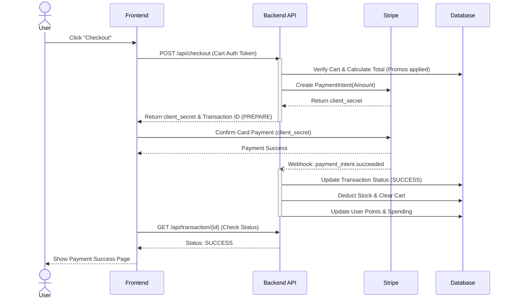

# Use Case Document

## FSSE2510 E-Commerce Platform

| Item               | Detail                  |
|--------------------|-------------------------|
| **Document Version** | 1.0                   |
| **Project Name**     | FSSE2510 E-Commerce   |

---

## 1. Actor Definitions

| Actor | Description |
|-------|-------------|
| **Unauthenticated User (Guest)** | Can browse products, view product details, access public coupons and promotions, and view the homepage showcase. Cannot checkout or manage a cart. |
| **Customer** | Authenticated user (via Firebase JWT). Can manage cart, create transactions, pay via Stripe, manage shipping addresses, earn membership points, and manage wishlist. |
| **Admin** | Authenticated user with `ROLE_ADMIN`. Can access the CMS, manage products, create promotions, handle coupons, configure navigation, manage users, and view all transactions. |
| **System Scheduler** | Automated background processes handling stock recovery and promotion lifecycle. |
| **Stripe System** | External payment gateway sending webhooks for payment state changes. |

---

## 2. Customer Use Cases

### UC-C01: Browse Products
* **Primary Actor**: Guest / Customer
* **Trigger**: User navigates to the shop page.
* **Main Success Scenario**:
  1. System displays a paginated list of active products.
  2. User inputs filter criteria (category, collection, tag, price range).
  3. System returns filtered, sorted product list.
* **Alternative Flow**:
  1. No products match criteria. System displays "No products found" message.

### UC-C02: View Product Details
* **Primary Actor**: Guest / Customer
* **Trigger**: User clicks on a product card.
* **Main Success Scenario**:
  1. System retrieves product via ID or URL slug.
  2. System returns product metadata, all variants, current stock per variant, and any active product-level promotions.
* **Alternative Flow**:
  1. Product does not exist or is inactive. System returns 404 Not Found.

### UC-C03: Add to Cart
* **Primary Actor**: Customer
* **Precondition**: User is logged in.
* **Trigger**: User clicks "Add to Cart" on a product variant page.
* **Main Success Scenario**:
  1. System checks requested quantity against available stock.
  2. System adds the variant to `CartItem`.
  3. System recalculates cart subtotal and returns updated cart.
* **Alternative Flow (Insufficient Stock)**:
  1. System rejects request with a 400 Bad Request indicating insufficient stock.

### UC-C04: Checkout & Payment
* **Primary Actor**: Customer
* **Precondition**: User has items in cart and a saved shipping address.
* **Trigger**: User clicks "Proceed to Checkout".
* **Main Success Scenario**:
  1. User selects shipping address and applies an optional coupon.
  2. System validates stock, calculates final amount (applying promotions & coupons).
  3. System moves `stock` to `reservedStock`.
  4. System creates a `Transaction` (`PENDING`) and requests a Payment Intent from Stripe.
  5. Stripe returns `client_secret`.
  6. Frontend handles payment via Stripe Elements.
  7. User completes 3D Secure verification.
  8. Stripe webhook triggers backend to set transaction to `SUCCESS` and deducts actual stock.
  9. System awards membership points.
#### Checkout Process Flow

### UC-C05: Manage Wishlist
* **Primary Actor**: Customer
* **Trigger**: User clicks the heart icon on a product.
* **Main Success Scenario**:
  1. System toggles the product in the user's wishlist (adds if not present, removes if present).
  2. System returns the updated wishlist array.

---

## 3. Admin Use Cases

### UC-A01: Manage Products
* **Primary Actor**: Admin
* **Precondition**: User has `ROLE_ADMIN`.
* **Main Success Scenario (Create)**:
  1. Admin submits product payload (name, desc, SEO slug, images, category, collection).
  2. Admin submits variants (SKU, size, colour, stock, price, weight).
  3. System saves product and its variants.
* **Alternative Flow (SKU Conflict)**:
  1. Another variant has the same SKU. System returns 409 Conflict.

### UC-A02: Manage Promotions
* **Primary Actor**: Admin
* **Trigger**: Marketing requires a new storewide sale or BOGO offer.
* **Main Success Scenario**:
  1. Admin selects promotion type (e.g., `PERCENTAGE_OFF`, `BOGO`, `BUNDLE`).
  2. Admin defines start and end dates, targeted items/tags, required membership tier, and discount value.
  3. Admin configures stacking flags (`isStackable`, `canStackWithCoupon`).
  4. System activates the promotion. When users checkout, the engine evaluates conditions and applies the optimal, non-conflicting discount logic.

### UC-A03: Manage Coupons
* **Primary Actor**: Admin
* **Trigger**: Marketing creates an influencer code.
* **Main Success Scenario**:
  1. Admin creates a coupon with code `SUMMER20`, 20% off, 100 max uses, valid for Gold/Diamond tiers, min spend $500.
  2. Customers enter code at checkout. System validates parameters and applies discount.

### UC-A04: Configure Navigation (Navbar CMS)
* **Primary Actor**: Admin
* **Trigger**: Admin wants to restructure the website menu.
* **Main Success Scenario**:
  1. Admin creates a parent node "Menswear".
  2. Admin creates a child node "Shirts" pointing to `/shop?category=MENS_SHIRTS` and sets `parentId` to the Menswear node.
  3. System updates the cached navigation tree.
* **Alternative Flow (Init)**:
  1. Admin clicks "Init Default Navbar". System seeds the database with predefined structured routes.

### UC-A05: View Transactions
* **Primary Actor**: Admin
* **Trigger**: Admin needs to fulfil orders or review refunds.
* **Main Success Scenario**:
  1. Admin views paginated list of all transactions across all users.
  2. Admin filters by status (`SUCCESS`).
  3. Admin views specific transaction details (shipping address, items, Stripe breakdown).

---

## 4. System Use Cases

### UC-S01: Stripe Webhook Reconciliation
* **Primary Actor**: Stripe System
* **Trigger**: A payment succeeds, fails, or is cancelled on Stripe's end.
* **Main Success Scenario (checkout.session.completed)**:
  1. System verifies signature using Stripe endpoint secret.
  2. System looks up `Transaction` by Stripe ID.
  3. System updates status to `SUCCESS`.
  4. System permanently deducts the reserved stock.
  5. System creates an async job to calculate and apply membership tier upgrades, grace period resolution, and points.
* **Alternative Flow (Invalid Signature)**:
  1. System rejects webhook with 400 Bad Request to prevent forged payment confirmations.

### UC-S02: Stale Pending Transaction Cleanup
* **Primary Actor**: System Scheduler
* **Trigger**: Cron job runs every 15 minutes.
* **Main Success Scenario**:
  1. System finds all `PENDING` transactions created >30 minutes ago.
  2. System sets transaction status to `ABORTED`.
  3. System moves `reservedStock` back to available `stock` per variant.
  4. System logs the recovery event.

### UC-S03: Stale Processing Transaction Reconciliation
* **Primary Actor**: System Scheduler
* **Trigger**: Cron job runs every 30 minutes.
* **Main Success Scenario**:
  1. System finds `PROCESSING` transactions older than 2 hours.
  2. System queries Stripe API for the payment intent status.
  3. If Stripe says 'succeeded' (webhook was missed), system forces local status to `SUCCESS` and handles stock/points.
  4. If Stripe says 'requires_payment_method' or 'cancelled', system voids the transaction and recovers stock.

### UC-S04: Promotion Ticker Cleanup
* **Primary Actor**: System Scheduler
* **Trigger**: Cron job runs daily at 02:00.
* **Main Success Scenario**:
  1. System finds all promotions where `endDate < currentTime`.
  2. System unlinks these promotions from all associated products.
  3. System sets promotion status to `EXPIRED`.
