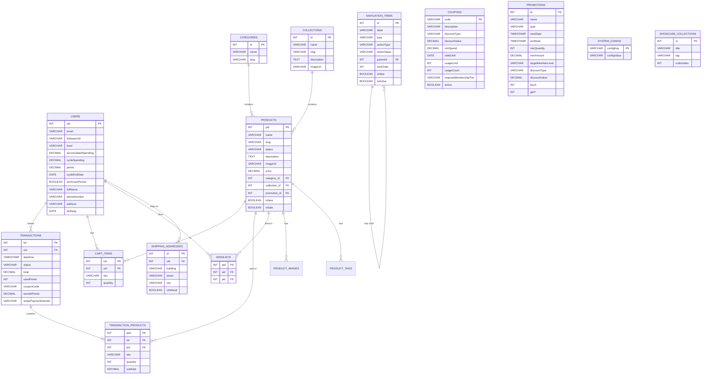

# Database Schema / Data Dictionary

## FSSE2510 E-Commerce Platform

| Item               | Detail                  |
|--------------------|-------------------------|
| **Document Version** | 1.1                   |
| **Project Name**     | FSSE2510 E-Commerce   |

---

## 1. Overview
This document outlines the database schema, including tables, columns, data types, and relationships for the FSSE2510 e-commerce platform. It maps accurately to the JPA Entities in the backend application.

## 2. Table Definitions

### 2.1 `users`
Stores user profile information, authentication mapping, and membership details.
*   **Primary Key**: `uid` (INT)
*   **Columns**:
    *   `uid` (INT, AUTO_INCREMENT) - Internal User ID (PK).
    *   `email` (VARCHAR, 255) - User's email address (UNIQUE, NOT NULL).
    *   `firebaseUid` (VARCHAR, 255) - Unique Firebase identifier (UNIQUE).
    *   `level` (VARCHAR, 50) - MembershipLevel Enum (e.g., 'NO_MEMBERSHIP', 'KOL_BRONZE', 'KOL_SILVER').
    *   `accumulatedSpending` (DECIMAL, 10,2) - Cumulative spending.
    *   `cycleSpending` (DECIMAL, 10,2) - Spending in current membership cycle.
    *   `points` (DECIMAL, 10,2) - Current accumulated points.
    *   `cycleEndDate` (DATE) - When the current membership cycle ends.
    *   `isInGracePeriod` (BOOLEAN) - Status denoting if the tier is in grace period.
    *   `fullName` (VARCHAR, 255) - User's full name.
    *   `phoneNumber` (VARCHAR, 20) - Contact number.
    *   `address` (VARCHAR, 255) - Address snippet.
    *   `birthday` (DATE) - User's date of birth.

### 2.2 `products`
Stores product catalog information and metadata.
*   **Primary Key**: `pid` (INT)
*   **Columns**:
    *   `pid` (INT, AUTO_INCREMENT) - Product ID (PK).
    *   `name` (VARCHAR, 255) - Product name (NOT NULL).
    *   `slug` (VARCHAR, 255) - URL-friendly slug.
    *   `status` (VARCHAR, 20) - e.g., 'AVAILABLE', 'HIDDEN', 'DELETED'.
    *   `description` (TEXT) - Product description.
    *   `imageUrl` (VARCHAR, 500) - URL to primary product image.
    *   `price` (DECIMAL, 10,2) - Current product price.
    *   `category_id` (INT) - FK to Category.
    *   `collection_id` (INT) - FK to Collection.
    *   `promotion_id` (INT) - FK to Promotion (active linked promotion).
    *   `isNew` (BOOLEAN) - New arrival indicator.
    *   `isSale` (BOOLEAN) - Sale item indicator.

### 2.3 `product_images`
Stores additional gallery images for products.
*   **Primary Key**: `id` (INT)
*   **Columns**:
    *   `id` (INT, AUTO_INCREMENT) - Image ID (PK).
    *   `pid` (INT) - FK to `products`.
    *   `imageUrl` (VARCHAR, 500) - URL of the image.

### 2.4 `product_tags` (Join Table)
Stores tags associated with products.
*   **Columns**: `product_id` (INT, FK), `tag` (VARCHAR, 50)

### 2.5 `cart_items`
Stores items currently in a user's shopping basket.
*   **Primary Key**: `cid` (INT)
*   **Foreign Keys**: `uid` -> `users(uid)`
*   **Columns**:
    *   `cid` (INT, AUTO_INCREMENT) - Cart item ID (PK).
    *   `uid` (INT) - Associated user (FK).
    *   `sku` (VARCHAR, 255) - Specific product variation/SKU.
    *   `quantity` (INT) - Quantity added to cart.

### 2.6 `transactions`
Stores checkout orders and their states.
*   **Primary Key**: `tid` (INT)
*   **Foreign Keys**: `uid` -> `users`
*   **Columns**:
    *   `tid` (INT, AUTO_INCREMENT) - Transaction ID (PK).
    *   `uid` (INT) - User who made the purchase (FK).
    *   `datetime` (TIMESTAMP) - Transaction completion time.
    *   `status` (VARCHAR, 50) - Action status ('PREPARE', 'SUCCESS', 'FAILED').
    *   `total` (DECIMAL, 10,2) - Final charge to the customer.
    *   `usedPoints` (INT) - Loyalty points used.
    *   `couponCode` (VARCHAR, 100) - Discount code applied.
    *   `earnedPoints` (DECIMAL, 10,2) - Points gained.
    *   `stripePaymentIntentId` (VARCHAR, 255) - Payment provider ID.
    *   `recipientName`, `phoneNumber`, `addressLine1`, `addressLine2`, `city`, `stateProvince`, `postalCode` - Denormalized shipping info.
    *   `version` (INT) - Optimistic locking version.

### 2.7 `transaction_products`
Snapshot of cart items at the moment of a successful checkout.
*   **Primary Key**: `tpid` (INT)
*   **Foreign Keys**: `tid` -> `transactions`
*   **Columns**:
    *   `tpid` (INT, AUTO_INCREMENT) - Line item ID (PK).
    *   `tid` (INT) - Associated transaction (FK).
    *   `pid` (INT) - Associated product (for reference).
    *   `sku` (VARCHAR, 255) - The exact variant code.
    *   `name`, `description`, `imageUrl`, `size`, `color`, `price` - Snapshots of product details.
    *   `quantity` (INT) - Quantity purchased.
    *   `subtotal` (DECIMAL, 10,2) - Pre-calculated total for the line.

### 2.8 `coupons`
Defines redeemable discount codes.
*   **Primary Key**: `code` (VARCHAR)
*   **Columns**:
    *   `code` (VARCHAR, 50) - Promo code text (PK) (e.g., 'SUMMER25').
    *   `description` (VARCHAR, 255) - Display description.
    *   `discountType` (VARCHAR) - 'PERCENTAGE' or 'FIXED'.
    *   `discountValue` (DECIMAL, 10,2) - Size of the discount.
    *   `minSpend` (DECIMAL, 10,2) - Minimum purchase threshold.
    *   `validUntil` (DATE) - Expiry constraint.
    *   `usageLimit` (INT) - Max global uses.
    *   `usageCount` (INT) - Times used so far.
    *   `requiredMembershipTier` (VARCHAR) - Member tier check.
    *   `active` (BOOLEAN) - Soft-delete flag.

### 2.9 `promotions`
Advanced automated discount rules.
*   **Primary Key**: `id` (INT)
*   **Columns**:
    *   `id` (INT, AUTO_INCREMENT) - Promotion rule ID (PK).
    *   `name` (VARCHAR, 255) - Promotional campaign name.
    *   `description` (TEXT)
    *   `type` (VARCHAR) - PromotionType Enum.
    *   `startDate` (TIMESTAMP), `endDate` (TIMESTAMP) - Validity window.
    *   `minQuantity` (INT), `minAmount` (DECIMAL, 10,2) - Buy conditions.
    *   `targetMemberLevel` (VARCHAR) - Only kicks in for specific tier.
    *   `discountType` (VARCHAR), `discountValue` (DECIMAL, 10,2)
    *   `buyX` (INT), `getY` (INT) - BOGO rules notation.

### 2.10 `shipping_addresses`
Stores user delivery address books.
*   **Primary Key**: `id` (INT)
*   **Columns**:
    *   `id` (INT, AUTO_INCREMENT) (PK)
    *   `uid` (INT) (FK to `users`)
    *   `building`, `street`, `district`, `city`, `country`, `unit` - Component details.
    *   `isDefault` (BOOLEAN) - Is it the primary selection?

### 2.11 `showcase_collections`
Homepage dynamic banners/carousels.
*   **Primary Key**: `id` (INT)
*   **Columns**:
    *   `id` (INT, AUTO_INCREMENT) (PK)
    *   `title` (VARCHAR, 255)
    *   `imageUrl`, `bannerUrl` - Graphical assets for desktop/mobile.
    *   `tag` (VARCHAR) - Filtering hook for linking to products.
    *   `orderIndex` (INT) - Display sorting position.
    *   `active` (BOOLEAN)

### 2.12 `wishlists`
Customer liked products.
*   **Primary Key**: `wid` (INT)
*   **Columns**:
    *   `wid` (INT, AUTO_INCREMENT) (PK)
    *   `pid` (INT) (FK to products)
    *   `uid` (INT) (FK to users)

### 2.13 `system_config`
Global system configurations.
*   **Primary Key**: `config_key` (VARCHAR)
*   **Columns**:
    *   `configKey` (VARCHAR, 50) (PK)
    *   `configValue` (VARCHAR, 255)

### 2.14 `categories`
Product categorization.
*   **Primary Key**: `id` (INT)
*   **Columns**:
    *   `id` (INT, AUTO_INCREMENT) (PK)
    *   `name` (VARCHAR, 255)
    *   `slug` (VARCHAR, 255)

### 2.15 `collections`
Product collections.
*   **Primary Key**: `id` (INT)
*   **Columns**:
    *   `id` (INT, AUTO_INCREMENT) (PK)
    *   `name` (VARCHAR, 255)
    *   `slug` (VARCHAR, 255)
    *   `description` (TEXT)
    *   `imageUrl` (VARCHAR, 500)

### 2.16 `navigation_items`
Top navigation bar item registry (supports hierarchical tree).
*   **Primary Key**: `id` (INT)
*   **Columns**:
    *   `id` (INT, AUTO_INCREMENT) (PK)
    *   `label` (VARCHAR, 255)
    *   `type` (VARCHAR) - e.g., 'TAB', 'DROPDOWN_ITEM'
    *   `actionType` (VARCHAR) - e.g., 'FILTER_COLLECTION', 'FILTER_CATEGORY', 'URL'
    *   `actionValue` (VARCHAR)
    *   `parentId` (INT) - Self-referencing FK for sub-menus.
    *   `sortOrder` (INT)
    *   `isNew` (BOOLEAN)
    *   `isActive` (BOOLEAN)

## 3. Relationships

*   **User (1) - to - Many (0..*) Cart Items**: A user can have multiple items in their cart.
*   **Product (1) - to - Many (0..*) Cart Items**: A product can exist in many carts.
*   **User (1) - to - Many (0..*) Transactions**: A user can make multiple transactions.
*   **Transaction (1) - to - Many (1..*) Transaction Products**: A transaction consists of one or more line items.
*   **Product (1) - to - Many (0..*) Transaction Products**: A product can be part of many transactions.

### Database ER Diagram

---
*End of Document*
