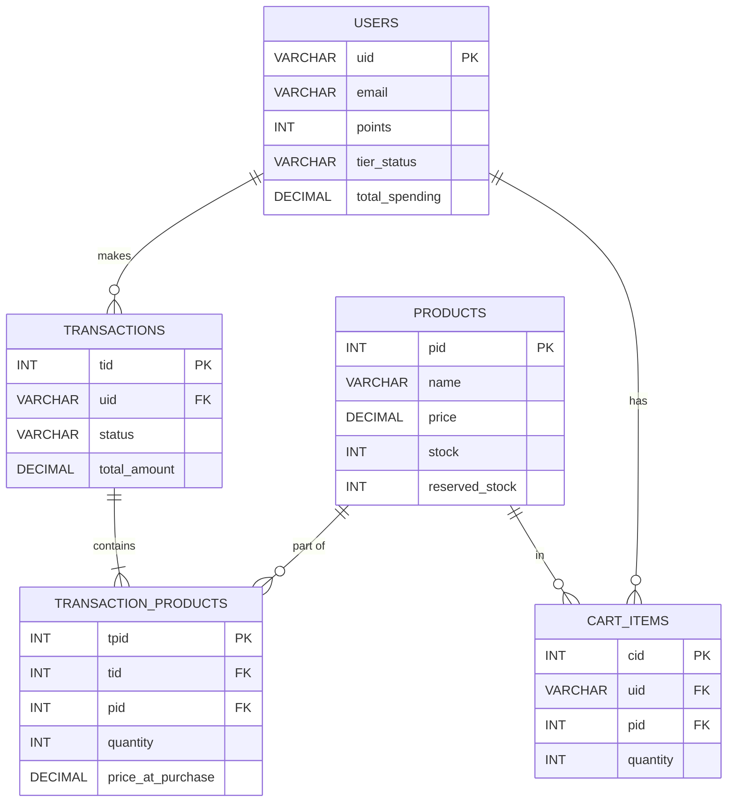

# Database Schema / Data Dictionary

## FSSE2510 E-Commerce Platform

| Item               | Detail                  |
|--------------------|-------------------------|
| **Document Version** | 1.0                   |
| **Project Name**     | FSSE2510 E-Commerce   |

---

## 1. Overview
This document outlines the database schema, including tables, columns, data types, and relationships for the FSSE2510 e-commerce platform.

## 2. Table Definitions

### 2.1 `users`
Stores user profile information, authentication mapping, and membership details.
*   **Primary Key**: `uid` (Firebase UID, VARCHAR)
*   **Columns**:
    *   `uid` (VARCHAR, 255) - Unique Firebase identifier (PK).
    *   `email` (VARCHAR, 255) - User's email address (UNIQUE, NOT NULL).
    *   `first_name` (VARCHAR, 50) - User's first name.
    *   `last_name` (VARCHAR, 50) - User's last name.
    *   `phone_number` (VARCHAR, 20) - Contact number.
    *   `points` (INT) - Current accumulated points (Default: 0).
    *   `tier_status` (VARCHAR, 20) - e.g., 'BASIC', 'KOL_BRONZE', 'KOL_SILVER' (Default: 'BASIC').
    *   `total_spending` (DECIMAL, 10,2) - Cumulative spending for tier calculation (Default: 0.00).
    *   `created_at` (TIMESTAMP) - Record creation time.
    *   `updated_at` (TIMESTAMP) - Last update time.

### 2.2 `products`
Stores product catalog information.
*   **Primary Key**: `pid` (INT, AUTO_INCREMENT)
*   **Columns**:
    *   `pid` (INT) - Product ID (PK).
    *   `name` (VARCHAR, 255) - Product name (NOT NULL).
    *   `description` (TEXT) - Product description.
    *   `image_url` (VARCHAR, 500) - URL to product image.
    *   `price` (DECIMAL, 10,2) - Product price (NOT NULL).
    *   `stock` (INT) - Available stock quantity (NOT NULL, >= 0).
    *   `reserved_stock` (INT) - Stock temporarily held during checkout (Default: 0).
    *   `status` (VARCHAR, 20) - e.g., 'ACTIVE', 'INACTIVE' (Default: 'ACTIVE').

### 2.3 `cart_items`
Stores items currently in a user's shopping cart.
*   **Primary Key**: `cid` (INT, AUTO_INCREMENT)
*   **Foreign Keys**: `uid` -> `users(uid)`, `pid` -> `products(pid)`
*   **Columns**:
    *   `cid` (INT) - Cart item ID (PK).
    *   `uid` (VARCHAR, 255) - Associated user (FK).
    *   `pid` (INT) - Associated product (FK).
    *   `quantity` (INT) - Quantity added to cart (NOT NULL, > 0).

### 2.4 `transactions`
Stores completed, pending, or failed checkout orders.
*   **Primary Key**: `tid` (INT, AUTO_INCREMENT)
*   **Foreign Keys**: `uid` -> `users(uid)`
*   **Columns**:
    *   `tid` (INT) - Transaction ID (PK).
    *   `uid` (VARCHAR, 255) - User who made the purchase (FK).
    *   `status` (VARCHAR, 20) - e.g., 'PREPARE', 'SUCCESS', 'FAILED'.
    *   `total_amount` (DECIMAL, 10,2) - Total amount calculated (after discounts).
    *   `stripe_payment_id` (VARCHAR, 255) - Stripe PaymentIntent ID for reconciliation.
    *   `created_at` (TIMESTAMP) - Order creation time.

### 2.5 `transaction_products`
Join table mapping products to a specific transaction, acting as an order line item.
*   **Primary Key**: `tpid` (INT, AUTO_INCREMENT)
*   **Foreign Keys**: `tid` -> `transactions(tid)`, `pid` -> `products(pid)`
*   **Columns**:
    *   `tpid` (INT) - Line item ID (PK).
    *   `tid` (INT) - Associated transaction (FK).
    *   `pid` (INT) - Associated product (FK).
    *   `quantity` (INT) - Quantity purchased.
    *   `price_at_purchase` (DECIMAL, 10,2) - Snapshot of price when bought.

## 3. Relationships

*   **User (1) - to - Many (0..*) Cart Items**: A user can have multiple items in their cart.
*   **Product (1) - to - Many (0..*) Cart Items**: A product can exist in many carts.
*   **User (1) - to - Many (0..*) Transactions**: A user can make multiple transactions.
*   **Transaction (1) - to - Many (1..*) Transaction Products**: A transaction consists of one or more line items.
*   **Product (1) - to - Many (0..*) Transaction Products**: A product can be part of many transactions.

### Database ER Diagram

---
*End of Document*
