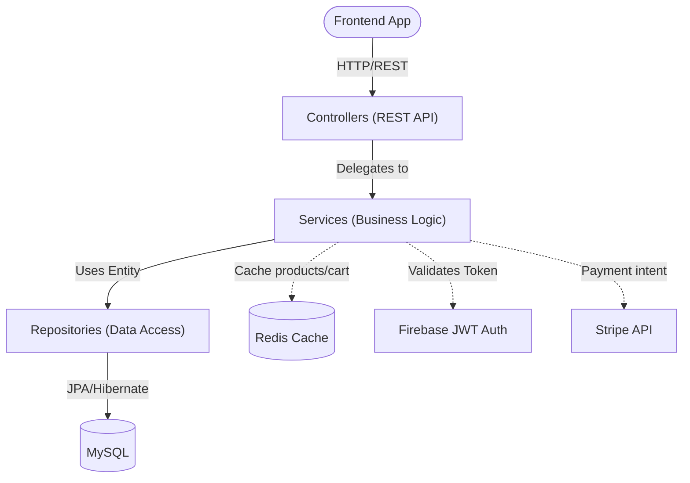

# System Architecture & Technical Design

## FSSE2510 E-Commerce Platform

| Item               | Detail                  |
|--------------------|-------------------------|
| **Document Version** | 1.0                   |
| **Project Name**     | FSSE2510 E-Commerce   |

---

## 1. Overview
This document describes the high-level architecture, technology stack, and structural design patterns used in the FSSE2510 E-Commerce Backend Platform.

## 2. Technology Stack

*   **Language**: Java 21
*   **Framework**: Spring Boot 3.5.8
*   **Database**: MySQL
*   **Cache**: Redis (Spring Boot Starter Data Redis)
*   **Mapping**: MapStruct 1.6.3
*   **Boilerplate Reduction**: Lombok
*   **ORM**: Spring Data JPA / Hibernate
*   **Security**: Spring Security + Firebase Admin SDK 9.3.0 (JWT Validation)
*   **Payment Integration**: Stripe API (Java SDK 24.1.0)
*   **Containerization**: Jib (Google Cloud Tools Jib)
*   **Build Tool**: Gradle

## 3. Core Modules

*   **User Module**: User matching via Firebase UID, role management (`ROLE_USER`, `ROLE_ADMIN`), profile updates.
*   **Product Module**: Products, Variations (SKUs), Categories, Collections, Tags.
*   **Cart Module**: Manages temporary shopping cart states and calculates prices based on product variations.
*   **Coupon & Promotion Module**: Handles specific discount codes, threshold discounts, product discounts, order discounts.
*   **Membership Module**: Manages spending cycles, points accruals, and tier evaluations (Basic, KOL Bronze, etc.).
*   **Shipping Address Module**: Stores user delivery addresses.
*   **Transaction Module**: Handles checkout flows, Stripe Payment Intents, webhooks, and order history snapshots.
*   **Wishlist Module**: Tracks user's liked products.
*   **CMS Module (Navigation, Showcase)**: Admin-managed dynamic navigation bars and homepage showcases.
*   **System Config Module**: System-wide configuration (e.g., point redemption rate, tier thresholds).
*   **Schedulers**: Runs background tasks (e.g., clearing stale `PREPARE` transactions, active promotions management).

## 4. High-Level Architecture

The system follows a standard **Monolithic N-Tier Architecture** suitable for API-driven platforms.

### Spring Boot Backend Layer Architecture

### 4.1 Layers
1. **Presentation Layer (Controllers)**
    *   Responsible for receiving REST API requests (`@RestController`).
    *   Handles DTO validation (`@Valid`).
    *   Returns structured JSON responses (including proper error handling via `@ControllerAdvice`).
2. **Business Logic Layer (Services)**
    *   Contains the core business rules (`@Service`).
    *   Handles transaction management (`@Transactional`).
    *   Integrates with external third-party services (Firebase, Stripe).
3. **Data Access Layer (Repositories)**
    *   Interface extensions of `CrudRepository` or `JpaRepository` (`@Repository`).
    *   Responsible for database communication.
4. **Data Entities (Models)**
    *   JPA Entities (`@Entity`) mapping to database tables.

### 4.2 Key Application Flows

*   **Authentication Flow**:
    1. Frontend logs in via Firebase (Google/Email).
    2. Frontend sends Firebase JWT in the `Authorization: Bearer <token>` header to the Backend.
    3. Backend Spring Security intercepts the request.
    4. Backend validates the JWT using Firebase Admin SDK.
    5. Backend extracts `uid` and asserts roles based on DB records or custom claims.
*   **Payment Flow**:
    1. User initiates checkout.
    2. Backend calculates total, reserves stock, creates a `PREPARE` transaction, and requests a `PaymentIntent` from Stripe.
    3. Frontend confirms payment with Stripe using the returned `client_secret`.
    4. Stripe sends a webhook to the Backend confirming success or failure.
    5. Backend updates transaction status, deducts reserved stock, clears cart, and awards points.

### 4.3 Service Layer Design Patterns

The `service` layer employs several advanced architectural patterns to ensure performance and maintainability:

*   **O(1) Memory Indexing & Double-Checked Locking Cache:**
    To prevent N+1 database queries when calculating discounts for large product lists, services like `ProductPromotionEnricherServiceImpl` fetch all active `PromotionEntity` records into thread-safe memory indexes (HashMaps grouped by Product ID, Category, etc.). The cache uses a `volatile` reference with double-checked locking, ensuring that only a single thread queries the database during cache invalidation (preventing Cache Stampedes).
*   **Generics-Based DTO Enrichment:**
    The system defines a `PromotionEnrichable` interface implemented by various response DTOs (e.g., `ProductResponseData`, `ProductSummaryData`). This allows the enricher services to apply identical, complex pricing and discount logic across multiple endpoints without duplicating business rules.
*   **Domain Separation & Aggregators:**
    Features are strictly decoupled (e.g., `StripeService` handles external API calls, while `TransactionService` manages local state). Cross-domain operations are handled by aggregator or enricher services (e.g., `CartPromotionEnricherService`), maintaining strict adherence to the Single Responsibility Principle.

## 5. Security Patterns

*   **Stateless Authentication**: The backend does NOT use JSESSIONID or server-side sessions. Every request is authenticated independently via JWT.
*   **CORS**: Configured globally to allow frontend domain access.
*   **Environment Variables**: Secrets like database passwords, Stripe API keys, and Firebase JSON configurations are injected via Environment Variables or `.env` / `application.yml` and are **never** committed to version control.

---
*End of Document*
