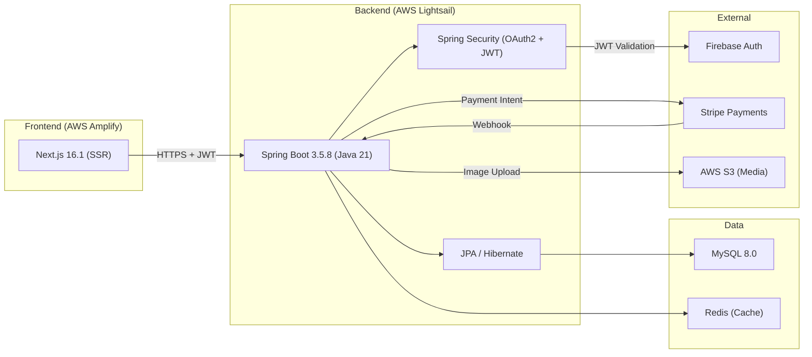
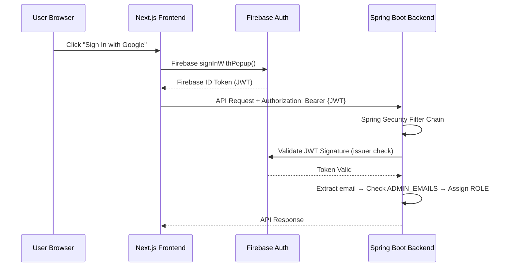

# Backend Architecture — Gelato Pique E-Commerce Platform

> **Version:** 2.0 | **Date:** 2026-03-18 | **Runtime:** Java 21 + Spring Boot 3.5.8

---

## 1. High-Level System Diagram



---

## 2. Technology Stack

| Technology | Version | Purpose |
|:---|:---|:---|
| Java | 21 | Language Runtime (Virtual Threads ready) |
| Spring Boot | 3.5.8 | Application Framework |
| Spring Security | — | OAuth2 Resource Server, RBAC |
| Spring Data JPA | — | ORM / Data Persistence |
| Spring Data Redis | — | Cache Management |
| MySQL | 8.0+ | Relational Database |
| MapStruct | — | DTO ↔ Entity Mapping |
| Lombok | — | Boilerplate Reduction |
| Stripe Java SDK | 24.1.0 | Payment Processing |
| AWS S3 SDK | — | Media Storage |
| Google Jib | — | Container Image Building (no Dockerfile) |

---

## 3. Layered Architecture

```
┌─────────────────────────────────────────────────────┐
│                   REST Controllers                   │  ← HTTP entry, receives DTOs
│  (ProductReadController, CartItemController, etc.)   │
├─────────────────────────────────────────────────────┤
│                 Mapper Layer (MapStruct)              │  ← DTO ↔ Entity Conversion
│ (ProductEntityMapper, TransactionDtoMapper, etc.)    │
├─────────────────────────────────────────────────────┤
│                 Service Layer (Business Logic)        │  ← Core logic, transaction mgmt
│ (TransactionService, ProductService, CartService)    │
├─────────────────────────────────────────────────────┤
│               Repository Layer (JPA/DAO)             │  ← Database Access
│ (ProductRepository, TransactionRepository, etc.)     │
├─────────────────────────────────────────────────────┤
│              Entity Layer (Domain Objects)            │  ← ORM mapping
│ (ProductEntity, UserEntity, TransactionEntity, etc.) │
└─────────────────────────────────────────────────────┘
         ↕                    ↕                  ↕
    MySQL 8.0            Redis Cache        External APIs
```

**Key Principles:**
- Entities are **never** exposed directly to Controllers (Defensive Boundary)
- MapStruct handles all Data Transformations
- Service Layer manages Business Rules + `@Transactional`
- `@ControllerAdvice` provides Global Exception Handling

---

## 4. Security Architecture



**Access Control Tiers:**

| Tier | Path Pattern | Description |
|:---|:---|:---|
| Public | `/public/**`, `/webhooks/**` | Anyone can access (product browsing, Stripe webhook) |
| Authenticated | `/cart/**`, `/transactions/**`, `/users/**`, `/wishlist/**`, `/addresses/**` | Requires valid JWT |
| Admin Only | `/admin/**`, `/products/**` | Requires ROLE_ADMIN |

---

## 5. Key Architectural Patterns

### 5.1 Two-Step Fetch Pattern (N+1 Prevention)
- JPA first queries `Slice<Integer>` (IDs only)
- Then shallow fetch by ID list (avoids JOIN memory bloat)
- Effectively prevents N+1 problems in paginated scenarios

### 5.2 Redis Cache Strategy
- Product details cached via `@Cacheable` (key = pid)
- Cache Invalidation: Admin updates evict related keys
- Supports high-concurrency reads, protects MySQL

### 5.3 Stripe Payment Integration
- **Payment Intent Pattern**: Backend creates Intent → Frontend completes via Stripe Elements
- **Webhook Verification**: Stripe signature validation ensures webhook authenticity
- **Lazy Reconciliation**: Dual confirmation prevents "Phantom Charges"

### 5.4 Optimistic Locking
- Transaction table uses `@Version` for optimistic locking
- Prevents race conditions between webhook and frontend status updates
