# Database Schema — Gelato Pique E-Commerce

> **Version:** 2.0 | **Date:** 2026-03-18 | **Database:** MySQL 8.0+

---

## Entity-Relationship Diagram

```mermaid
erDiagram
    USER {
        int uid PK
        string email
        string firebase_uid UK
        enum level "MembershipLevel"
        decimal accumulated_spending
        decimal cycle_spending
        decimal points
        date cycle_end_date
        boolean is_in_grace_period
        string fullName
        string phoneNumber
        string address
        date birthday
    }

    PRODUCT {
        int pid PK
        string name
        string slug UK
        string status
        text description
        string image_url
        decimal price
        int category_id FK
        int collection_id FK
        string product_type
        json details
        boolean is_new
        boolean is_sale
        string promotion_badge_text
        boolean is_featured
        int featured_priority
        int promotion_id FK
    }

    PRODUCT_INVENTORY {
        int id PK
        int pid FK
        string sku UK
        string size
        string color
        int stock
        int stock_reserved
        decimal weight
    }

    PRODUCT_IMAGE {
        int id PK
        int pid FK
        string url
        int sort_order
    }

    CATEGORY {
        int id PK
        string name UK
        string slug UK
    }

    PRODUCT_COLLECTION {
        int id PK
        string name UK
        string slug UK
        string description
        string image_url
    }

    PRODUCT_TAGS {
        int pid FK
        string tag
    }

    CART_ITEM {
        int cid PK
        int uid FK
        int pid FK
        string sku
        int quantity
    }

    WISHLIST {
        int id PK
        int uid FK
        int pid FK
    }

    TRANSACTION {
        int tid PK
        int buyer_uid FK
        datetime datetime
        enum status "PaymentStatus"
        decimal total
        int used_points
        string coupon_code
        decimal earned_points
        string stripe_payment_intent_id
        string recipient_name
        string phone_number
        string address_line_1
        string address_line_2
        string city
        string state_province
        string postal_code
        int version
    }

    TRANSACTION_PRODUCT {
        int tpid PK
        int tid FK
        int pid
        string sku
        string name
        string description
        string image_url
        string size
        string color
        decimal price
        int quantity
        decimal subtotal
    }

    SHIPPING_ADDRESS {
        int id PK
        int uid FK
        string recipient_name
        string phone_number
        string address_line_1
        string address_line_2
        string city
        string state_province
        string postal_code
        boolean is_default
    }

    COUPON {
        string code PK
        string description
        enum discount_type "PERCENTAGE/FIXED"
        decimal discount_value
        decimal min_spend
        date valid_until
        int usage_limit
        int usage_count
        enum required_membership_tier
        boolean is_active
    }

    PROMOTION {
        int id PK
        string name
        string description
        enum type "PromotionType"
        datetime start_date
        datetime end_date
        int min_quantity
        decimal min_amount
        enum target_member_level
        enum discount_type
        decimal discount_value
        int buy_x
        int get_y
    }

    PROMOTION_TARGET_PID {
        int promotion_id FK
        int target_pid
    }

    PROMOTION_TARGET_CATEGORIES {
        int promotion_id FK
        string category
    }

    PROMOTION_TARGET_COLLECTIONS {
        int promotion_id FK
        string collection
    }

    PROMOTION_TARGET_TAGS {
        int promotion_id FK
        string tag
    }

    MEMBERSHIP_CONFIG {
        enum level PK "MembershipLevel"
        decimal min_spend
        decimal point_rate
        int grace_period_days
    }

    NAVIGATION_ITEM {
        int id PK
        string label
        string type "TAB/DROPDOWN_ITEM"
        string action_type
        string action_value
        int parent_id FK
        int sort_order
        boolean is_new
        boolean is_active
    }

    SHOWCASE_COLLECTION {
        int id PK
        string title
        string image_url
        string banner_url
        string tag
        int order_index
        boolean active
    }

    SYSTEM_CONFIG {
        string config_key PK
        text config_value
        string description
    }

    USER ||--o{ CART_ITEM : "has"
    USER ||--o{ WISHLIST : "has"
    USER ||--o{ TRANSACTION : "places"
    USER ||--o{ SHIPPING_ADDRESS : "manages"
    PRODUCT ||--o{ PRODUCT_INVENTORY : "has variants"
    PRODUCT ||--o{ PRODUCT_IMAGE : "has images"
    PRODUCT ||--o{ PRODUCT_TAGS : "tagged"
    PRODUCT ||--o{ CART_ITEM : "in cart"
    PRODUCT ||--o{ WISHLIST : "wishlisted"
    PRODUCT }o--o| CATEGORY : "belongs to"
    PRODUCT }o--o| PRODUCT_COLLECTION : "belongs to"
    PRODUCT }o--o| PROMOTION : "has promotion"
    TRANSACTION ||--o{ TRANSACTION_PRODUCT : "contains"
    PROMOTION ||--o{ PROMOTION_TARGET_PID : "targets products"
    PROMOTION ||--o{ PROMOTION_TARGET_CATEGORIES : "targets categories"
    PROMOTION ||--o{ PROMOTION_TARGET_COLLECTIONS : "targets collections"
    PROMOTION ||--o{ PROMOTION_TARGET_TAGS : "targets tags"
    NAVIGATION_ITEM ||--o{ NAVIGATION_ITEM : "has children"
```

---

## Key Design Decisions

### 1. Transaction Product Snapshot Pattern
`transaction_product` stores product snapshots (name, price, image_url, size, color) rather than FK references. When original products are modified/deleted, historical order data remains intact.

### 2. Shipping Address Snapshot on Transaction
Transaction table embeds recipient address fields (recipient_name, address_line_1, etc.) as snapshots. This ensures that even if users later modify/delete addresses, order delivery info remains correct.

### 3. Coupon Code as Primary Key
Coupon table uses `code` (e.g., "SUMMER2025") as PK instead of auto-increment ID. This simplifies the coupon redemption flow since the code itself is the unique identifier.

### 4. Membership Level as Enum
User `level` field uses `MembershipLevel` enum (NO_MEMBERSHIP, BRONZE, SILVER, GOLD, DIAMOND), paired with `membership_config` table defining thresholds, point rates, and grace periods.

### 5. Promotion Multi-Target System
Promotions use four `@ElementCollection` tables (target_pid, target_categories, target_collections, target_tags) for flexible multi-dimensional targeting. A single Promotion can target specific products, categories, collections, or tags simultaneously.

### 6. Navigation Item Self-Referencing Tree
NavigationItem uses self-referencing (parent_id → id) to build hierarchical navigation. Supports TAB and DROPDOWN_ITEM types with sort_order for display control.

### 7. System Config Key-Value Store
`system_config` uses key-value pattern for system-level config (e.g., free shipping threshold, default page size), allowing runtime changes without redeployment.

### 8. Optimistic Locking
Transaction table uses `@Version` for optimistic locking, preventing race conditions from concurrent payment operations.

### 9. Performance Indexes
- Product: covering index `idx_product_category_pid_desc` for efficient category browsing
- Product slug: unique index for SEO-friendly URLs
- NavigationItem: `idx_nav_parent` and `idx_nav_sort` for fast navigation queries
- User: `idx_user_firebase_uid` unique index for JWT validation

---

## Enums Reference

| Enum | Values |
|:---|:---|
| `MembershipLevel` | NO_MEMBERSHIP, BRONZE, SILVER, GOLD, DIAMOND |
| `PaymentStatus` | PREPARE, PENDING, PROCESSING, SUCCESS, FAILED |
| `DiscountType` | PERCENTAGE, FIXED |
| `PromotionType` | PERCENTAGE_DISCOUNT, FIXED_DISCOUNT, BUY_X_GET_Y, MEMBER_EXCLUSIVE |
