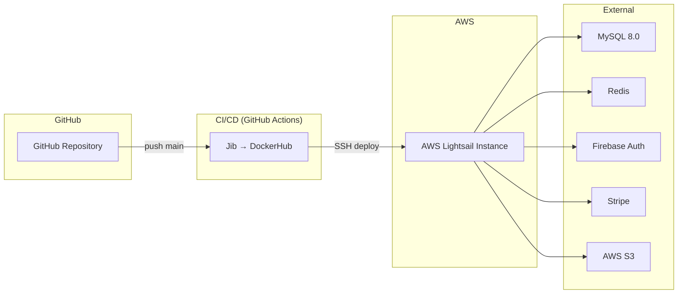

# Deployment Guide — Backend

> **Version:** 2.0 | **Date:** 2026-03-18 | **Platform:** AWS Lightsail

---

## Architecture Overview



---

## 1. CI/CD Pipeline

1. `push` to `main` triggers GitHub Actions
2. **Google Jib** builds container image directly (no Dockerfile needed)
3. Push image to DockerHub: `johnmak101/project-backend:latest`
4. SSH to Lightsail instance: `docker compose pull && docker compose up -d`

---

## 2. Docker Compose

```yaml
version: '3.8'
services:
  backend:
    image: docker.io/johnmak101/project-backend:latest
    container_name: fsse-backend
    ports:
      - "8080:8080"
    restart: always
    env_file:
      - .env
    environment:
      - JAVA_TOOL_OPTIONS=-Xms512m -Xmx1g -XX:MaxMetaspaceSize=160m -Xss512k -XX:+UseG1GC
    deploy:
      resources:
        limits:
          memory: 1.5G
```

---

## 3. Environment Variables

| Category | Variables | Description |
|:---|:---|:---|
| Database | `DB_URL`, `DB_USER`, `DB_PASSWORD` | MySQL connection |
| Cache | `REDIS_HOST`, `REDIS_PORT`, `REDIS_PASSWORD` | Redis connection |
| Security | `JWT_ISSUER_URI` | Firebase Auth URI (e.g., `https://securetoken.google.com/<project-id>`) |
| AWS S3 | `AWS_S3_BUCKET`, `AWS_S3_REGION`, `AWS_ACCESS_KEY`, `AWS_SECRET_KEY`, `IMAGE_BASE_URL` | Product image uploads |
| Stripe | `STRIPE_SECRET_KEY`, `STRIPE_WEBHOOK_SECRET` | Payment processing |
| App | `ADMIN_EMAILS`, `APP_FRONTEND_URL` | RBAC admin config + CORS origin |

---

## 4. Local Development Setup

```bash
# 1. Copy env file
cp .env.example .env

# 2. Fill in your secrets in .env

# 3. Ensure MySQL + Redis are running locally
#    (or use Docker containers)

# 4. Start server
./gradlew bootRun

# Server runs on http://localhost:8080
```

---

## 5. JVM Tuning (Lightsail 1GB Instance)

| Flag | Value | Purpose |
|:---|:---|:---|
| `-Xms512m` | 512 MB | Initial heap size |
| `-Xmx1g` | 1 GB | Maximum heap size |
| `-XX:MaxMetaspaceSize=160m` | 160 MB | Metaspace limit |
| `-Xss512k` | 512 KB | Thread stack size |
| `-XX:+UseG1GC` | G1 | Garbage collector optimized for low latency |

---

## 6. Troubleshooting

| Issue | Cause | Solution |
|:---|:---|:---|
| 401 Unauthorized | JWT_ISSUER_URI mismatch | Confirm format: `https://securetoken.google.com/<project-id>` |
| Stripe Webhook Signature Failed | Webhook secret mismatch | Ensure `.env` secret matches Stripe Dashboard |
| Redis Connection Refused | Redis not running | `docker ps` to check Redis container |
| CORS Error | Frontend URL mismatch | Confirm `APP_FRONTEND_URL` is correct |
| OOM Killed | JVM exceeds container memory | Check `-Xmx` + container memory limit |
