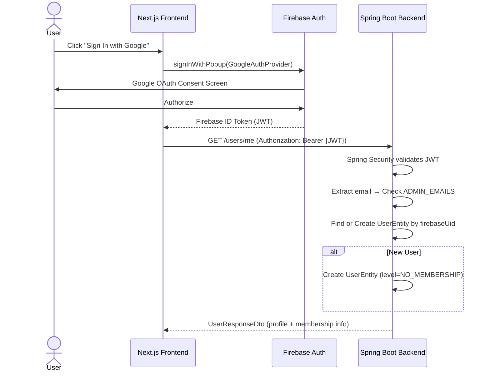
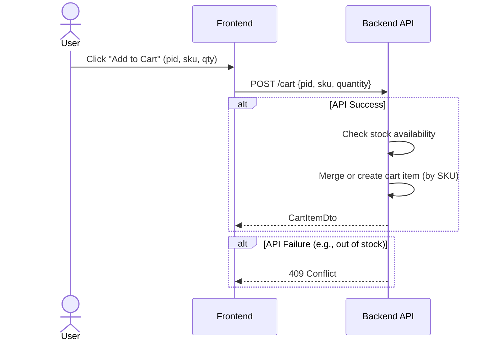
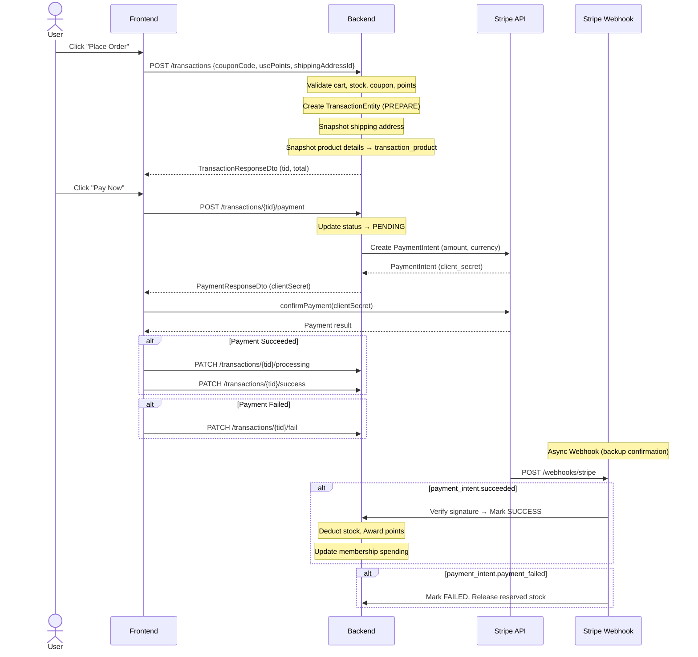
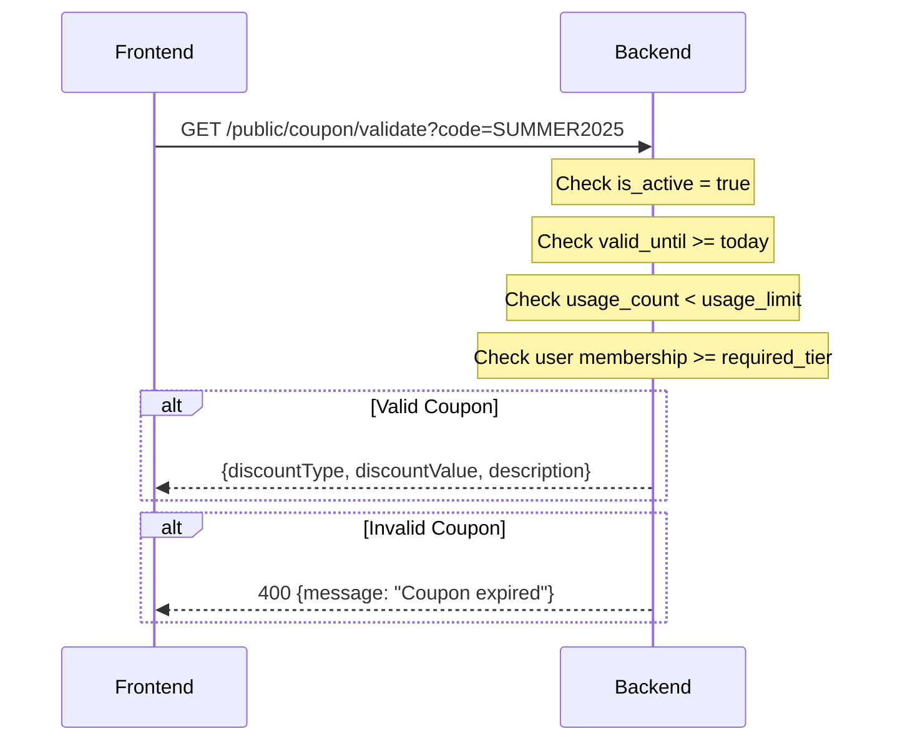
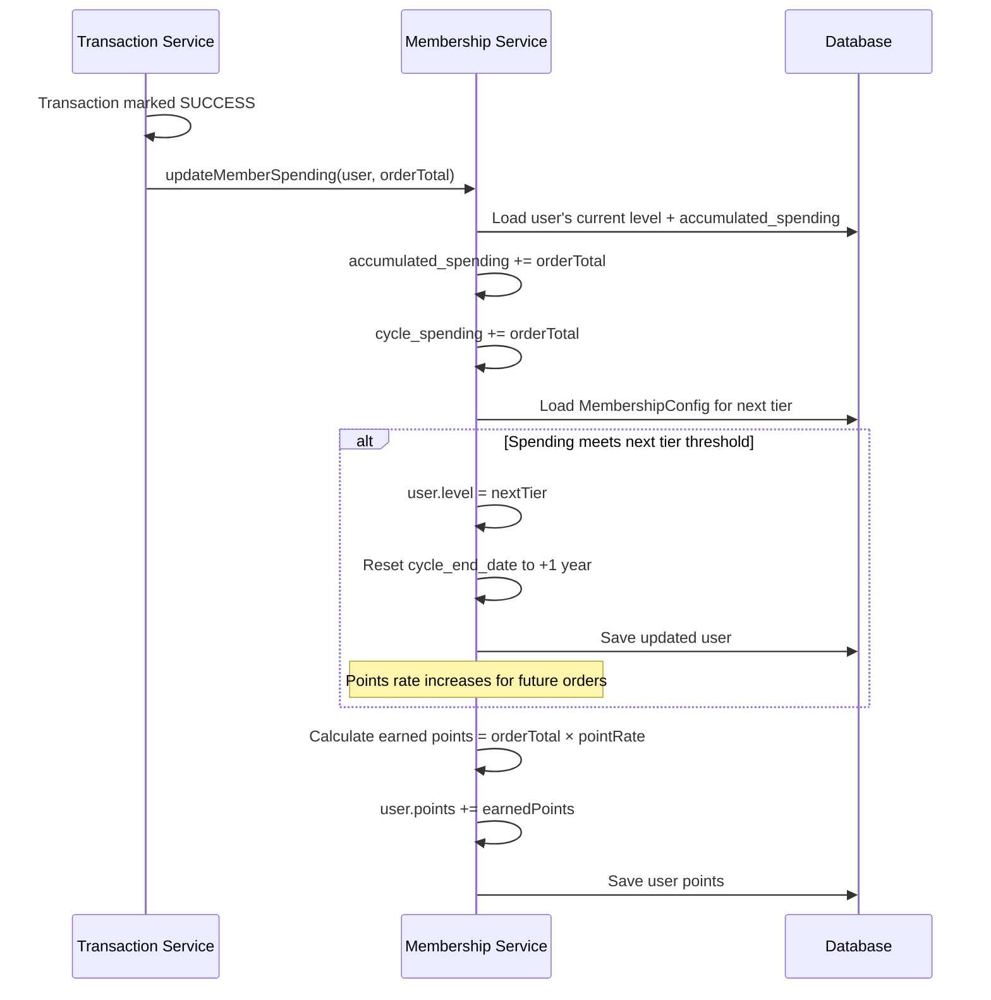
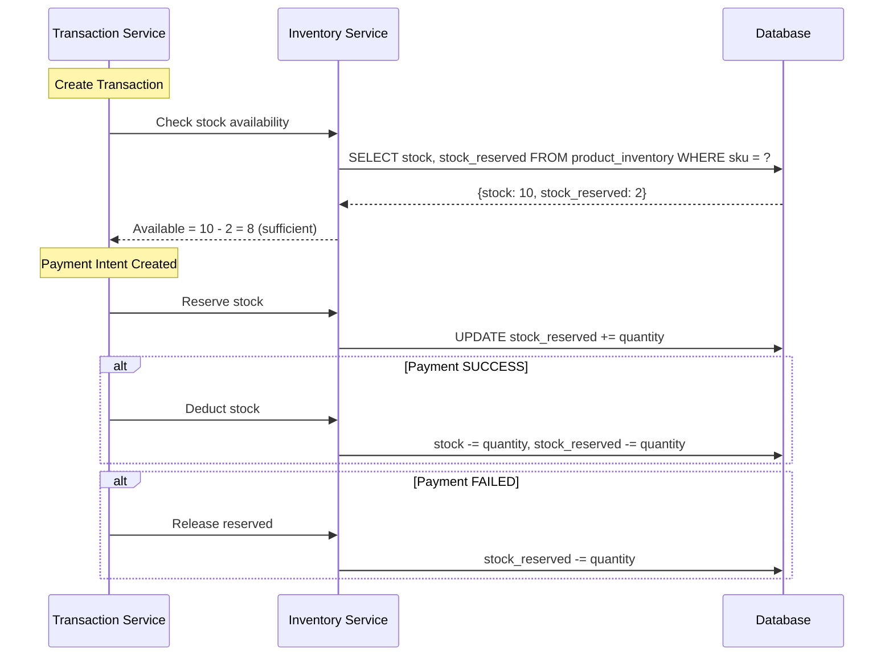

# Sequence Diagrams — Backend Key Flows

> **Version:** 2.0 | **Date:** 2026-03-18

---

## 1. User Authentication Flow

---

## 2. Add to Cart Flow

---

## 3. Complete Checkout Flow

---

## 4. Coupon Validation Flow

---

## 5. Membership Tier Upgrade Flow

---

## 6. Stock Reserve & Deduction Flow

