# Use Cases — Backend

> **Version:** 2.0 | **Date:** 2026-03-18

---

## Actors

| Actor | Description |
|:---|:---|
| **Visitor** | Unauthenticated user browsing the store |
| **Shopper** | Authenticated user with a valid JWT |
| **Member** | Shopper with membership tier (BRONZE+) |
| **Admin** | User with ROLE_ADMIN (email in ADMIN_EMAILS) |
| **Stripe** | External payment system (webhooks) |
| **Firebase** | External identity provider (JWT issuer) |

---

## Use Case Diagram

```mermaid
graph TB
    subgraph Actors
        V["👤 Visitor"]
        S["🛒 Shopper"]
        M["⭐ Member"]
        A["🔧 Admin"]
        ST["💳 Stripe"]
    end

    subgraph "Product Catalog"
        UC1["Browse Products"]
        UC2["Search Products"]
        UC3["View Product Details"]
        UC4["Filter & Sort"]
    end

    subgraph "Shopping"
        UC5["Manage Cart"]
        UC6["Manage Wishlist"]
        UC7["Manage Addresses"]
    end

    subgraph "Checkout & Payment"
        UC8["Create Transaction"]
        UC9["Apply Coupon"]
        UC10["Redeem Points"]
        UC11["Complete Payment"]
        UC12["Handle Webhook"]
    end

    subgraph "Account"
        UC13["Sign In (Google)"]
        UC14["Update Profile"]
        UC15["View Order History"]
    end

    subgraph "Admin Panel"
        UC16["Manage Products"]
        UC17["Manage Coupons"]
        UC18["Manage Promotions"]
        UC19["Manage Users"]
        UC20["Manage Transactions"]
        UC21["Configure Membership"]
        UC22["Manage Showcase"]
    end

    V --> UC1
    V --> UC2
    V --> UC3
    V --> UC4
    S --> UC5
    S --> UC6
    S --> UC7
    S --> UC8
    S --> UC9
    S --> UC11
    S --> UC13
    S --> UC14
    S --> UC15
    M --> UC10
    A --> UC16
    A --> UC17
    A --> UC18
    A --> UC19
    A --> UC20
    A --> UC21
    A --> UC22
    ST --> UC12
```

---

## UC-01: Browse Products

| Field | Detail |
|:---|:---|
| **Actor** | Visitor |
| **Precondition** | None |
| **Trigger** | User navigates to product listing page |
| **Main Flow** | 1. System receives GET `/public/products` with optional filters 2. System executes Two-Step Fetch (IDs → shallow fetch) 3. System returns paginated product list with `hasNext` indicator |
| **Alt Flow** | No products match filters → return empty list with `hasNext = false` |
| **Postcondition** | Product list displayed with pagination metadata |

---

## UC-05: Manage Cart

| Field | Detail |
|:---|:---|
| **Actor** | Shopper |
| **Precondition** | User is authenticated |
| **Trigger** | User adds/updates/removes cart items |
| **Main Flow** | 1. User sends POST/PATCH/DELETE to `/cart` 2. System validates product exists and has stock 3. System updates cart (merge if same SKU) 4. System returns updated cart item |
| **Alt Flow A** | Product out of stock → return 409 Conflict |
| **Alt Flow B** | Same SKU already in cart → increment quantity |
| **Postcondition** | Cart state persisted in database |

---

## UC-08: Create Transaction (Checkout)

| Field | Detail |
|:---|:---|
| **Actor** | Shopper |
| **Precondition** | User has items in cart, profile is complete |
| **Trigger** | User clicks "Place Order" |
| **Main Flow** | 1. System validates all cart items have sufficient stock 2. System validates coupon (if provided) 3. System calculates discount stacking (coupon → points) 4. System creates Transaction with PREPARE status 5. System snapshots products into `transaction_product` 6. System snapshots shipping address into transaction 7. System clears user's cart 8. System returns TransactionResponseDto |
| **Alt Flow A** | Insufficient stock → return 409, cart unchanged |
| **Alt Flow B** | Invalid coupon → return 400 with validation message |
| **Alt Flow C** | Insufficient points → return 400 |
| **Postcondition** | Transaction created, cart emptied, stock not yet deducted |

---

## UC-11: Complete Payment

| Field | Detail |
|:---|:---|
| **Actor** | Shopper |
| **Precondition** | Transaction exists with PREPARE status |
| **Trigger** | User initiates payment |
| **Main Flow** | 1. Frontend POSTs to `/transactions/{tid}/payment` 2. Backend creates Stripe PaymentIntent, sets status to PENDING 3. Backend returns `clientSecret` 4. Frontend renders Stripe Elements, user enters card 5. On success: PATCH `.../processing`, then PATCH `.../success` 6. Stripe webhook confirms payment asynchronously |
| **Alt Flow** | Payment fails → PATCH `.../fail`, release reserved stock |
| **Postcondition** | SUCCESS: stock deducted, points awarded, membership updated |

---

## UC-12: Handle Stripe Webhook

| Field | Detail |
|:---|:---|
| **Actor** | Stripe (system) |
| **Precondition** | PaymentIntent exists for the transaction |
| **Trigger** | Stripe sends webhook event |
| **Main Flow** | 1. Stripe POSTs to `/webhooks/stripe` 2. System verifies Stripe signature 3. For `payment_intent.succeeded`: mark SUCCESS, deduct stock, award points 4. For `payment_intent.payment_failed`: mark FAILED, release stock |
| **Alt Flow** | Invalid signature → return 400, log security event |
| **Postcondition** | Transaction status finalized, inventory adjusted |

---

## UC-16: Manage Products (Admin)

| Field | Detail |
|:---|:---|
| **Actor** | Admin |
| **Precondition** | User has ROLE_ADMIN |
| **Trigger** | Admin creates/edits/deletes products |
| **Main Flow** | 1. Admin sends CRUD requests to `/products` 2. System validates product data 3. System auto-generates slug for SEO 4. System evicts Redis cache on write operations 5. System returns updated product data |
| **Alt Flow** | Duplicate slug → return 409 Conflict |
| **Postcondition** | Product persisted, cache invalidated |

---

## UC-21: Configure Membership (Admin)

| Field | Detail |
|:---|:---|
| **Actor** | Admin |
| **Precondition** | User has ROLE_ADMIN |
| **Trigger** | Admin updates membership tier configuration |
| **Main Flow** | 1. Admin PUTs to `/admin/membership/configs/{level}` 2. System updates min_spend, point_rate, grace_period_days 3. Changes apply to all future transactions |
| **Postcondition** | Membership thresholds updated |
