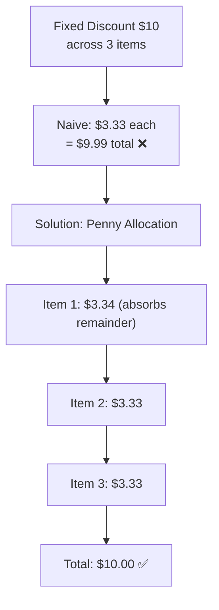

# Cart Promotion Enricher Flow

> How the backend enriches cart items with active promotions and calculates discounted prices.

## Enrichment Pipeline

```mermaid
flowchart TD
    A[GET /cart] --> B[CartItemService.getUserCart]
    B --> C[Fetch CartItem entities<br/>with ProductInventory + Product]
    C --> D[CartPromotionEnricherService.enrichCartItems]

    D --> E[Load all active promotions<br/>where now BETWEEN start AND end]
    E --> F[For each CartItem]

    F --> G{Product has<br/>direct promotion_id?}
    G -- Yes --> H[Use product-level promotion]
    G -- No --> I[PromotionApplicabilityService<br/>findBestApplicable]

    I --> I1[Check targetPids match]
    I1 --> I2[Check targetCategories match]
    I2 --> I3[Check targetCollections match]
    I3 --> I4[Check targetTags match]
    I4 --> I5[Check minQuantity / minAmount]
    I5 --> I6[Check targetMemberLevel]
    I6 --> I7[Select highest discount<br/>among all matching]

    H --> J[Calculate discounted price]
    I7 --> J

    J --> J1{Promotion Type?}
    J1 -- PERCENTAGE_OFF --> J2[price × (1 - discount/100)]
    J1 -- FIXED_OFF --> J3[price - discountValue]
    J1 -- BUY_X_GET_Y --> J4[Apply free item logic]

    J2 --> K[Set item.price = discounted<br/>Set item.originalPrice = original<br/>Set item.promotionBadgeText]
    J3 --> K
    J4 --> K

    K --> L[Return enriched cart items<br/>with promotion metadata]
```

## Discount Distribution (Penny Problem)

> When distributing fixed discounts across multiple items, rounding errors can accumulate.


