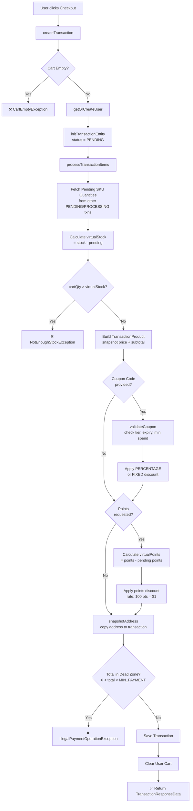
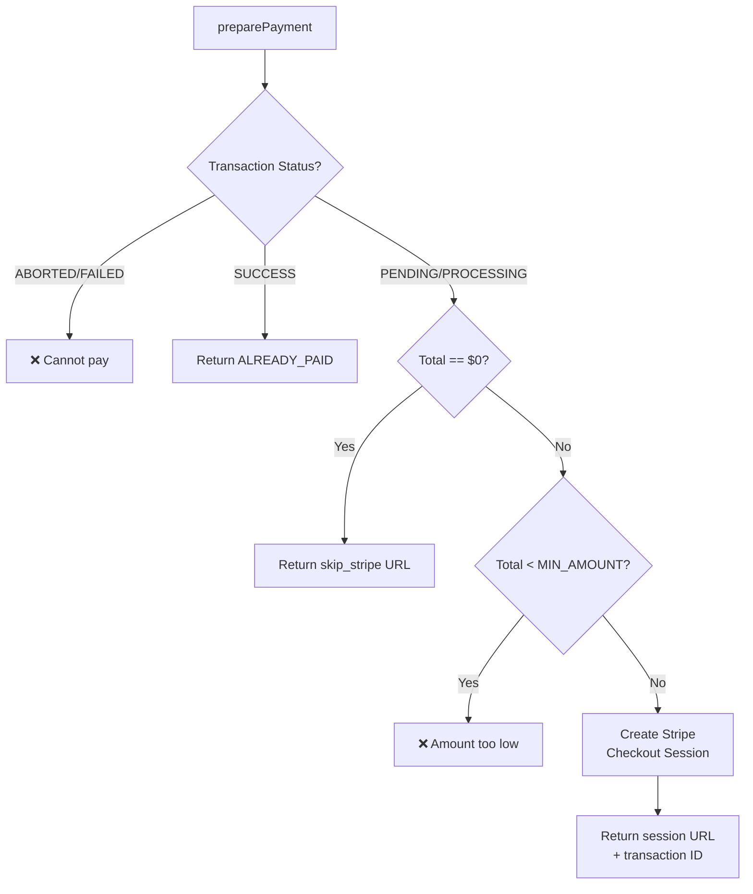
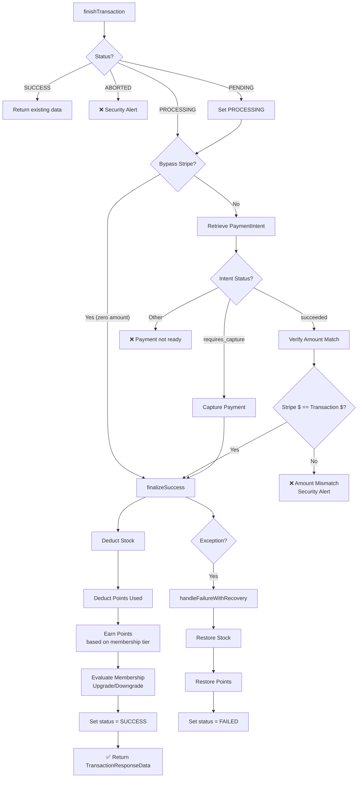
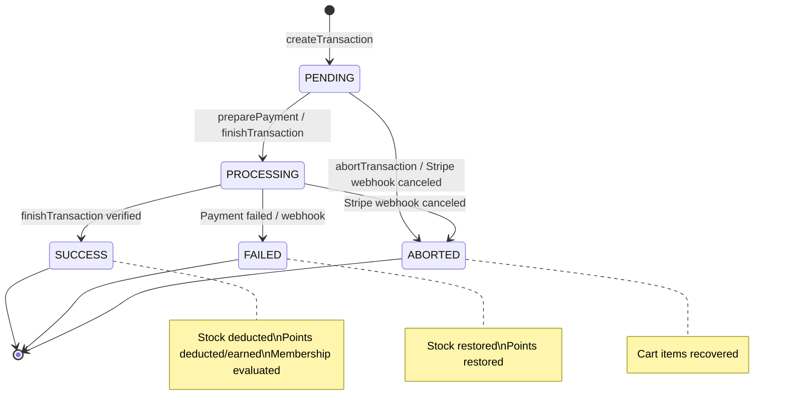

# Checkout & Transaction Flow

> End-to-end checkout flow from cart to payment completion.

## 1. Create Transaction

## 2. Prepare Payment (Stripe Checkout)

## 3. Finish Transaction (Payment Verification)

## 4. Transaction State Machine

