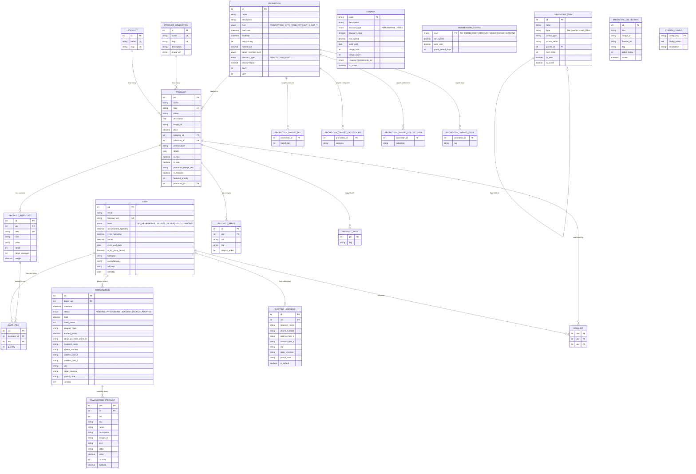

# Entity Relationship Diagram

> Complete database schema for the E-Commerce backend.

```mermaid
erDiagram
    USER {
        int uid PK
        string email
        string firebase_uid UK
        enum level "NO_MEMBERSHIP | BRONZE | SILVER | GOLD | DIAMOND"
        decimal accumulated_spending
        decimal cycle_spending
        decimal points
        date cycle_end_date
        boolean is_in_grace_period
        string fullName
        string phoneNumber
        string address
        date birthday
    }

    CATEGORY {
        int id PK
        string name UK
        string slug UK
    }

    PRODUCT_COLLECTION {
        int id PK
        string name UK
        string slug UK
        string description
        string image_url
    }

    PRODUCT {
        int pid PK
        string name
        string slug UK
        string status
        text description
        string image_url
        decimal price
        int category_id FK
        int collection_id FK
        string product_type
        json details
        boolean is_new
        boolean is_sale
        string promotion_badge_text
        boolean is_featured
        int featured_priority
        int promotion_id FK
    }

    PRODUCT_INVENTORY {
        int id PK
        int pid FK
        string sku UK
        string size
        string color
        int stock
        int stock_reserved
        decimal weight
    }

    PRODUCT_IMAGE {
        int id PK
        int pid FK
        string url
        string tag
        int display_order
    }

    PRODUCT_TAGS {
        int pid FK
        string tag
    }

    PROMOTION {
        int id PK
        string name
        string description
        enum type "PERCENTAGE_OFF | FIXED_OFF | BUY_X_GET_Y"
        datetime startDate
        datetime endDate
        int minQuantity
        decimal minAmount
        enum target_member_level
        enum discount_type "PERCENTAGE | FIXED"
        decimal discountValue
        int buyX
        int getY
    }

    PROMOTION_TARGET_PID {
        int promotion_id FK
        int target_pid
    }

    PROMOTION_TARGET_CATEGORIES {
        int promotion_id FK
        string category
    }

    PROMOTION_TARGET_COLLECTIONS {
        int promotion_id FK
        string collection
    }

    PROMOTION_TARGET_TAGS {
        int promotion_id FK
        string tag
    }

    CART_ITEM {
        int cid PK
        int inventory_id FK
        int uid FK
        int quantity
    }

    TRANSACTION {
        int tid PK
        int buyer_uid FK
        datetime datetime
        enum status "PENDING | PROCESSING | SUCCESS | FAILED | ABORTED"
        decimal total
        int used_points
        string coupon_code
        decimal earned_points
        string stripe_payment_intent_id
        string recipient_name
        string phone_number
        string address_line_1
        string address_line_2
        string city
        string state_province
        string postal_code
        int version
    }

    TRANSACTION_PRODUCT {
        int tpid PK
        int tid FK
        int pid
        string sku
        string name
        string description
        string image_url
        string size
        string color
        decimal price
        int quantity
        decimal subtotal
    }

    COUPON {
        string code PK
        string description
        enum discount_type "PERCENTAGE | FIXED"
        decimal discount_value
        decimal min_spend
        date valid_until
        int usage_limit
        int usage_count
        enum required_membership_tier
        boolean is_active
    }

    MEMBERSHIP_CONFIG {
        enum level PK "NO_MEMBERSHIP | BRONZE | SILVER | GOLD | DIAMOND"
        decimal min_spend
        decimal point_rate
        int grace_period_days
    }

    SHIPPING_ADDRESS {
        int id PK
        int uid FK
        string recipient_name
        string phone_number
        string address_line_1
        string address_line_2
        string city
        string state_province
        string postal_code
        boolean is_default
    }

    WISHLIST {
        int wid PK
        int pid FK
        int uid FK
    }

    NAVIGATION_ITEM {
        int id PK
        string label
        string type "TAB | DROPDOWN_ITEM"
        string action_type
        string action_value
        int parent_id FK
        int sort_order
        boolean is_new
        boolean is_active
    }

    SHOWCASE_COLLECTION {
        int id PK
        string title
        string image_url
        string banner_url
        string tag
        int order_index
        boolean active
    }

    SYSTEM_CONFIG {
        string config_key PK
        text config_value
        string description
    }

    %% === Relationships ===
    CATEGORY ||--o{ PRODUCT : "has many"
    PRODUCT_COLLECTION ||--o{ PRODUCT : "has many"
    PROMOTION ||--o{ PRODUCT : "applied to"
    PRODUCT ||--o{ PRODUCT_INVENTORY : "has variants"
    PRODUCT ||--o{ PRODUCT_IMAGE : "has images"
    PRODUCT ||--o{ PRODUCT_TAGS : "tagged with"
    PROMOTION ||--o{ PROMOTION_TARGET_PID : "targets products"
    PROMOTION ||--o{ PROMOTION_TARGET_CATEGORIES : "targets categories"
    PROMOTION ||--o{ PROMOTION_TARGET_COLLECTIONS : "targets collections"
    PROMOTION ||--o{ PROMOTION_TARGET_TAGS : "targets tags"
    USER ||--o{ CART_ITEM : "has cart items"
    PRODUCT_INVENTORY ||--o{ CART_ITEM : "added to cart"
    USER ||--o{ TRANSACTION : "places orders"
    TRANSACTION ||--o{ TRANSACTION_PRODUCT : "contains items"
    USER ||--o{ SHIPPING_ADDRESS : "has addresses"
    USER ||--o{ WISHLIST : "wishlists"
    PRODUCT ||--o{ WISHLIST : "wishlisted by"
    NAVIGATION_ITEM ||--o{ NAVIGATION_ITEM : "has children"
```
