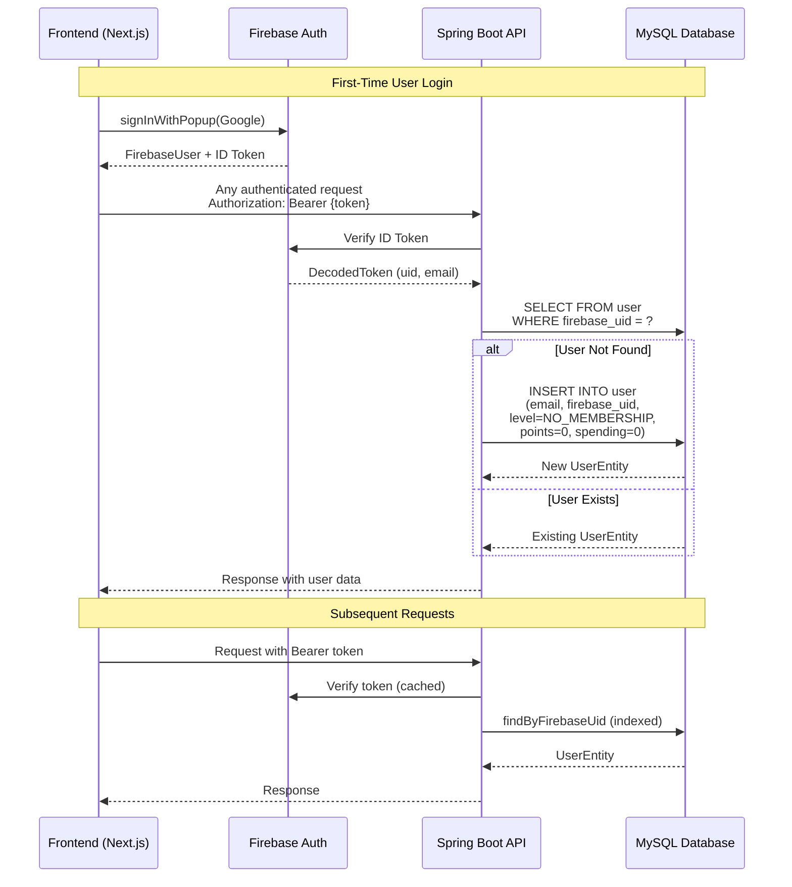
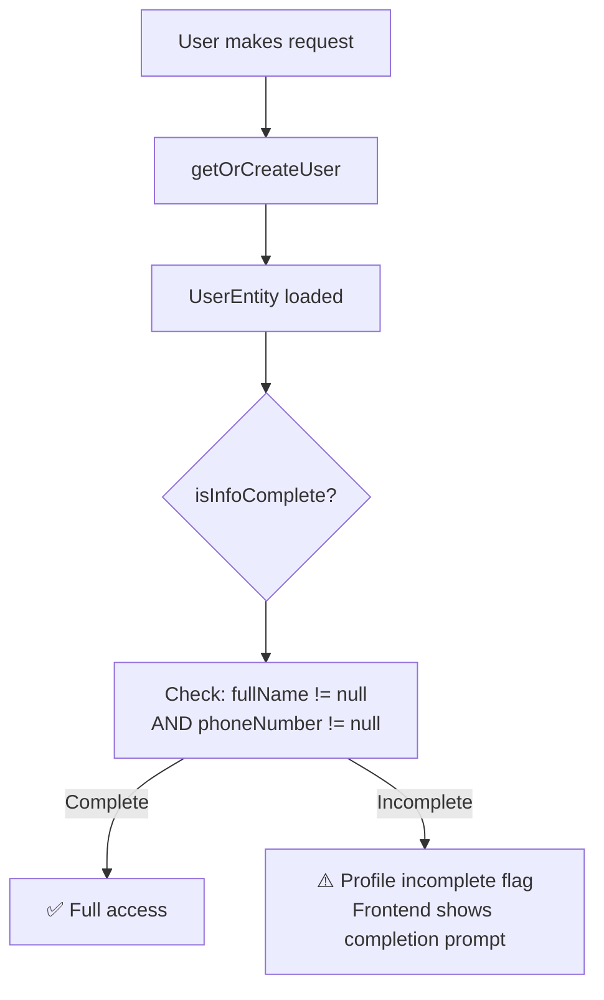
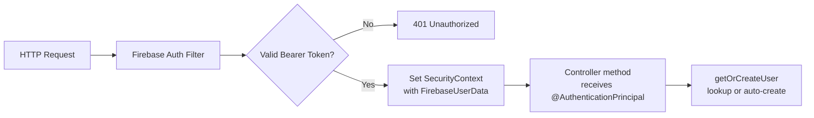

# Firebase User Synchronization

> How Firebase Auth users are synchronized with the backend database.

## Sequence Diagram

```mermaid
sequenceDiagram
    participant Client as Frontend (Next.js)
    participant Firebase as Firebase Auth
    participant API as Spring Boot API
    participant DB as MySQL Database

    Note over Client,DB: First-Time User Login
    Client->>Firebase: signInWithPopup(Google)
    Firebase-->>Client: FirebaseUser + ID Token
    Client->>API: Any authenticated request<br/>Authorization: Bearer {token}

    API->>Firebase: Verify ID Token
    Firebase-->>API: DecodedToken (uid, email)

    API->>DB: SELECT FROM user<br/>WHERE firebase_uid = ?
    alt User Not Found
        API->>DB: INSERT INTO user<br/>(email, firebase_uid,<br/>level=NO_MEMBERSHIP,<br/>points=0, spending=0)
        DB-->>API: New UserEntity
    else User Exists
        DB-->>API: Existing UserEntity
    end

    API-->>Client: Response with user data

    Note over Client,DB: Subsequent Requests
    Client->>API: Request with Bearer token
    API->>Firebase: Verify token (cached)
    API->>DB: findByFirebaseUid (indexed)
    DB-->>API: UserEntity
    API-->>Client: Response
```

## User Profile Completion Check

```mermaid
flowchart TD
    A[User makes request] --> B[getOrCreateUser]
    B --> C[UserEntity loaded]
    C --> D{isInfoComplete?}
    D --> E["Check: fullName != null<br/>AND phoneNumber != null"]
    E -- Complete --> F[✅ Full access]
    E -- Incomplete --> G[⚠️ Profile incomplete flag<br/>Frontend shows completion prompt]
```

## Security Filter Chain

```mermaid
flowchart LR
    A[HTTP Request] --> B[Firebase Auth Filter]
    B --> C{Valid Bearer Token?}
    C -- No --> D[401 Unauthorized]
    C -- Yes --> E[Set SecurityContext<br/>with FirebaseUserData]
    E --> F[Controller method<br/>receives @AuthenticationPrincipal]
    F --> G[getOrCreateUser<br/>lookup or auto-create]
```
