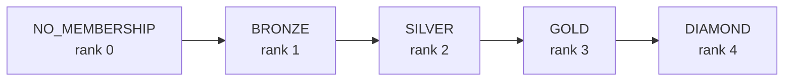
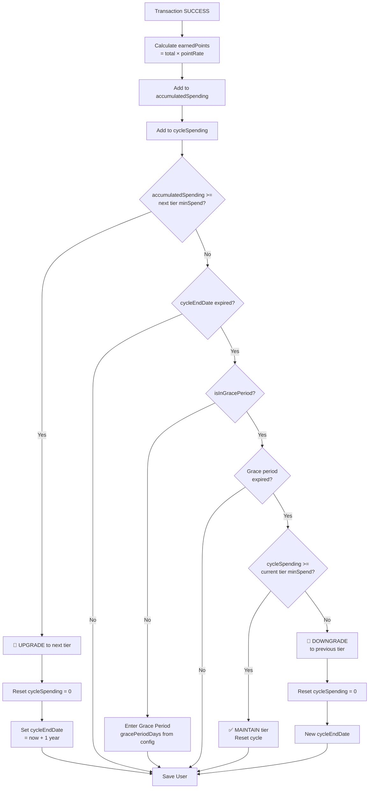

# Membership State Machine

> Membership tier lifecycle: upgrade, maintain, and downgrade logic.

## Tier Hierarchy

## Membership Evaluation Flow

> Triggered after every successful transaction via `finalizeSuccess`.

## Membership Config Table

| Level | Min Spend | Point Rate | Grace Period |
|-------|-----------|------------|--------------|
| NO_MEMBERSHIP | $0 | 0% | 0 days |
| BRONZE | $500 | 1% | 30 days |
| SILVER | $2,000 | 2% | 30 days |
| GOLD | $5,000 | 3% | 60 days |
| DIAMOND | $10,000 | 5% | 90 days |

> **Note:** Values above are example configs from `membership_config` table. Actual values are admin-configurable.
